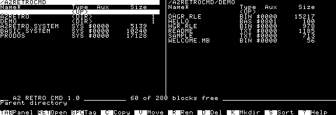
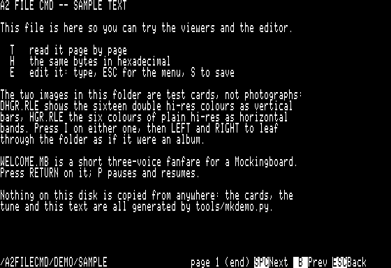
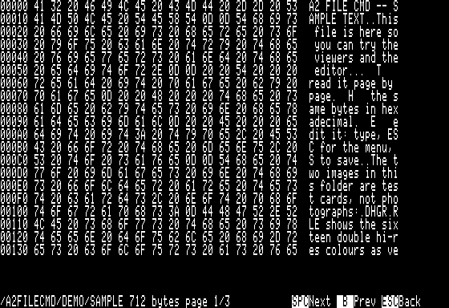
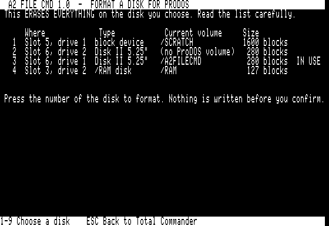

<div align="center">

# A2FileCmd

**Two panels. One Apple II.**

A complete ProDOS file manager for the Apple IIe.\
Browse disks, unpack archives, read documents, view pictures and play music — in 128 KB.

[](https://github.com/habib256/a2filecmd/releases/latest)
[](https://github.com/habib256/a2filecmd/actions/workflows/ci.yml)
[](LICENSE)

**[Download](https://github.com/habib256/a2filecmd/releases/latest) · [Manual](docs/MANUAL.md) · [Changelog](CHANGELOG.md) · [Plugin SDK](sdk/README.md)**



*80 columns. Keyboard and mouse. Boots from a single 5.25" floppy.*

</div>

Inspired by [A2Command, Ammonoid and Norton Commander](#inspirations),
A2FileCmd brings the familiar source-and-destination workflow to your Apple II.
Tag a group of files and copy them across. Open a disk image like a folder. Unpack a ShrinkIt archive,
read an AppleWorks letter, or leaf through a directory of double hi-res
pictures. The tools are right there, beside your files.

## What you can do

| | |
|---|---|
| **Manage your files** | Copy, move, rename and delete files or whole directory trees. Tag batches, sort by name, size or type, change ProDOS attributes and lock files. Progress bars and overwrite prompts keep transfers clear. |
| **Explore disks and images** | Browse ProDOS and DOS 3.3 disk images as read-only folders, then extract files to the other panel. Read physical DOS 3.3 disks, create and write floppy images, copy floppies and format ProDOS disks. |
| **Unpack classic archives** | Extract ShrinkIt `.SHK` archives, including LZW/1 and LZW/2 compression, and Binary II `.BNY` archives with their ProDOS file attributes. |
| **Read, edit and compare** | Text and hex viewers, a 5 KB text editor, readable Applesoft listings and an AppleWorks word-processing viewer. Compare two files byte by byte, search files for text, or mark differences between panels. |
| **Enjoy pictures and sound** | Full-screen HGR and DHGR, raw or RLE-compressed. Use the arrow keys to browse pictures like an album. Play `.MB` and `.PT3` music in foreground overlays on a Mockingboard; Left/Right browse tunes of the same type. PT3 accepts modules up to 65,535 bytes, preserves `/RAM`, and displays title, artist and player credits. |
| **Make it yours** | Keyboard shortcuts throughout, optional AppleMouse II support and remembered panel settings. Launch SYS, BIN, Applesoft and Integer BASIC programs, or add your own tools with the plugin SDK. |

The **!** menu groups tools by category. Choose a category, then a tool;
Escape goes back one level. Questions on the penultimate line appear in inverse
video while waiting for your answer.

The menu also offers text and disk-image conversion, CRC-32, file
identification, Markdown reading, volume-wide search, favourite directories,
batch renaming and type repair. DISKTOOLS and XL also provide UNDELETE recovery,
DISKCMP comparison, MKIMAGE creation, RESCUE extraction, SYNC updates and TREE totals. BLKVIEW searches and extracts blocks while preserving the source; DISKIMG reads back disk writes.
DISASM reads BIN/SYS files as 6502 or 65C02 assembly and exports text listings.
FIND combines name/content searches with type and modification-date filters (TAB),
then continues through successive pages of 20 matches. V on a text result
shows occurrence offsets and excerpts; ESC returns to the same list.
VERIFY handles tagged files and VOLINFO exports allocation reports and file blocks.
DATE, TAGPAT, TXTCONV, VOLNAME and
WIPE also fit the floppy edition. See the [tool reference](docs/MANUAL.md#more-tools-in-the--menu).

## See it in action

<table>
  <tr>
    <td width="50%"><br><strong>Double hi-res, full screen</strong><br>Browse HGR and DHGR pictures with the arrow keys.</td>
    <td width="50%"><br><strong>Read without leaving your files</strong><br>Page through text, Applesoft listings and AppleWorks documents.</td>
  </tr>
  <tr>
    <td width="50%"><br><strong>Look inside any file</strong><br>Inspect hexadecimal bytes and their text side by side.</td>
    <td width="50%"><br><strong>Keep your disks ready</strong><br>Format Disk II, SmartPort and RAM volumes.</td>
  </tr>
</table>

*Screenshots from v0.5; the current release adds archive extraction, document
readers and more disk tools. See the [changelog](CHANGELOG.md).*

## Download and boot

**Start with the [latest release](https://github.com/habib256/a2filecmd/releases/latest).**
No build required. Choose the image that fits your setup:

The table describes the current 0.8.0 source build. The latest published release
is 0.7.5; its downloads retain their own version numbers.

| Image (0.8.0) | Contents |
|---|---|
| `A2FILECMD-6502-BOOT-0.8.0.dsk` | Bootable 140 KB floppy: file manager, essential disk tools and formatter |
| `A2FILECMD-6502-FILES-0.8.0.dsk` | Edit and read documents, find, rename, copy, synchronize and unpack files |
| `A2FILECMD-6502-MEDIA-0.8.0.dsk` | Pictures and Mockingboard music |
| `A2FILECMD-6502-DISKTOOLS-0.8.0.dsk` | Disk images, block tools, boot repair and recovery |
| `A2FILECMD-6502-DEVTOOLS-0.8.0.dsk` | BASIC listings, disassembly, BASIC.SYSTEM and INTBASIC.SYSTEM |
| `A2FILECMD-6502-XL-0.8.0.2mg` | Complete bootable 32 MB image for 6502 |
| `A2FILECMD-65C02-XL-0.8.0.2mg` | Complete bootable 32 MB image for 65C02, with optional mouse support |

**All floppies use 6502 code**, including on enhanced machines. Choose the
categories you need; every companion carries the menu and full catalog.
XL includes all 59 overlays, BASIC.SYSTEM, INTBASIC.SYSTEM, `DEMO/` and `IMGHGR/`, so it needs
no companion. Choose XL **6502** for an original IIe; XL **65C02** for an
enhanced IIe or //c. All editions require 128 KB and 80 columns.
Use matching releases. Do not mix the native plugins of XL 65C02 with the
6502 floppies. Floppies are distributed as `.dsk`; XL uses `.2mg`.

1. Boot BOOT or XL. ProDOS 8 is included. With floppies, put the required
   category in slot 6, drive 2. With one drive, A2FC names the required disk
   and drive; press **1**, insert that disk, then press **Return**.
   `make disk` builds all seven volumes; `ARCH=6502` builds the floppies and
   XL 6502, while `ARCH=enh` builds XL 65C02 only.

2. Press **`TAB`** to switch panels, **`RETURN`** to open and **`ESC`** to go up. Press **`?`** for the full key map.
3. On the `.2mg`, explore the `DEMO/` folder already open in the right panel. On BOOT, the right panel shows the available volumes; `E`, `I` and the `!` menu load missing tools from the matching category disk.

A **Mockingboard** enables music playback (including the **Mockingboard 4c**
on Apple //c at `$C400–$C4FF`); an **AppleMouse II** enables point
and click navigation. Both are optional and can be in any supported slot.

**Tested on real hardware:** Apple //c, enhanced Apple IIe and unenhanced
Apple IIe, with successful operation confirmed by the maintainer on September 12,
2026. Also tested in [Virtual II](https://www.virtualii.com/) and
[POM2](https://github.com/habib256/pom2), including the //c and unenhanced
1983 IIe with the 6502 build. The Apple IIgs has not been tried yet.

### Take a quick tour

The hard-disk image includes examples generated especially for A2FileCmd:

- Open `DHGR.RLE` or `HGR.RAW` to see the picture viewer; use **Left / Right** to browse.
- Read `SAMPLE`, list the `HELLO` Applesoft program with **`T`**, or open the AppleWorks `LETTER`.
- Open `TINY.PO`, `TINY.2MG` or `DOS33.DSK` as a folder; **`C`** extracts a selected file to the other panel.
- Select `SAMPLE.SHK` or `SAMPLE.BNY`, press **`!`** and choose its extractor.
- With a Mockingboard, open `WELCOME.MB` for a fanfare; **`P`** pauses or resumes it.

> **Using `/RAM`?** DHGR pictures and single-drive floppy copying use auxiliary
> memory and can rebuild `/RAM` empty. A2FC asks for explicit consent before
> destructive AUX use. Save its files elsewhere first. MB1/PT3 playback uses
> main memory, preserves `/RAM`, and returns to both panels when the music ends.

### Install on an existing hard disk

Copy `A2FILE.SYSTEM` and the complete `A2FILE/` folder **side by side** into
any directory. Keep the program and its overlays from the same release.
Launch `A2FILE.SYSTEM` from Bitsy Bye or with `-A2FILE.SYSTEM` from BASIC
in that directory. Settings and support files live beside the program.

<details>
<summary>Verify your download</summary>

Download `SHA256SUMS-<version>.txt` from the same release into the image's
directory, with `<version>` the release you downloaded. To verify one image
on macOS:

```sh
shasum -a 256 A2FILECMD-65C02-XL-<version>.2mg
```

Compare the result with its line in `SHA256SUMS-<version>.txt`. To check
every image and the PDF together on Linux:

```sh
sha256sum -c SHA256SUMS-<version>.txt
```

</details>

## The keys you'll use most

| Key | Action |
|---|---|
| `TAB` · `RETURN` · `ESC` | Switch panel · open · go up |
| Up / Down · Left / Right | Select an entry · page through a directory |
| `SPACE` | Tag a file for a batch operation |
| `C` · `V` · `R` · `D` · `K` | Copy · move · rename · delete · make directory — a full-width progress bar, panels updating file by file, `ESC` to stop |
| `T` · `H` · `I` · `E` | Read text or a document · inspect hex · view a picture · edit text |
| `W` · `F` | Disk-image tools · format a disk |
| `!` | Open the plugin menu, including archive extraction, compare and search |
| `?` · `Q` | Help · quit to ProDOS |

With a mouse, click a file to select it and click again to open it. Column
headers change the sort order; the path goes up; the bottom bar runs commands.
The [manual](docs/MANUAL.md) covers every shortcut and file format.
A [printable PDF](docs/A2FILECMD-MANUAL-EN.pdf) is also included in each release.

<details>
<summary>Limits to keep in mind</summary>

- Large directories are read in windows of 139 disk entries plus the parent entry, in disk order without sorting.
- ProDOS paths are limited to 64 characters.
- The text editor holds 5,104 bytes; a `.MB` tune must fit in 4,096 bytes.
- Images opened as folders are read-only. Extract files before viewing or editing them; ProDOS image extraction supports files up to 128 KB, and subdirectories must be entered individually.
- Launching another program replaces A2FileCmd. The FORMAT overlay returns directly to the panels; from Applesoft, you can relaunch A2FileCmd as described in the manual.

</details>

## Build it. Extend it.

A2FileCmd is written in C and 6502 assembly, built with **cc65 2.19 or later**
and **Python 3**. The disk-image tools and demo generators are included.

```sh
make          # build the ProDOS program and its overlays
make disk     # five 6502 floppies (.po/.dsk), plus XL 6502 and 65C02 (.2mg)
make test     # run checks that do not need an Apple II
```

`make bench` exercises the program in [POM2](https://github.com/habib256/pom2).
See the [bench guide](bench/README.md) for setup and coverage.

Want to add a tool? The **[plugin SDK](sdk/README.md)** includes a worked
example, a build script and a stable API. Plugins appear in the **`!`** menu
and work with the selected file.

| Directory | Contents |
|---|---|
| [`src/`](src/) | File manager, launcher, drivers and plugins |
| [`sdk/`](sdk/) | Plugin guide, example and build tools |
| [`tools/`](tools/) | Disk-image tools, format readers and demo generators |
| [`bench/`](bench/) | Emulator sessions and verification |
| [`data/`](data/) | Help, boot blocks, ProDOS and BASIC.SYSTEM |
| [`docs/`](docs/) | Manual, release notes and screenshots |

Found a bug or have an idea? [Open an issue](https://github.com/habib256/a2filecmd/issues).
For a bug, include the release, machine or emulator, disk format and steps to reproduce it.

## Inspirations

A2FileCmd owes a tip of the hat to these file managers. Explore the programs
that inspired it, from the classic two-panel workflow to serial virtual drives:

| Inspiration | What it brings to A2FileCmd | Disk-image download |
|---|---|---|
| **A2Command** | The Commander-style file and disk manager on Apple II. | [A2Command 1.1 — ZIP containing `a2cmd-1.1-140k.po`](https://mirrors.apple2.org.za/ftp.apple.asimov.net/utility/A2Command%20v1.1.zip), preserved by the Asimov mirror. |
| **[Ammonoid](https://github.com/colinleroy/a2tools)**, by Colin Leroy | An Apple II file manager and an inspiration for integrated serial virtual drives. | [Download `ammonoid.po`](https://github.com/colinleroy/a2tools/releases/latest/download/ammonoid.po) from the author's latest release. |
| **Norton Commander** | The classic two-panel interface and keyboard command bar. | [Norton Commander 3.0 — floppy images on WinWorld](https://winworldpc.com/download/d0ee2b62-911a-11ec-84e0-0200008a0da4) (7z archive; choose a download mirror). **For IBM PC compatibles running DOS.** |

## Credits

Created by **Arnaud VERHILLE** (`@habib256`). Free software under the
[GNU GPL v3](LICENSE), in the spirit of A2Command, Ammonoid and Norton Commander.

The disk images include **ProDOS 8 2.4.3** and **BASIC.SYSTEM**, distributed
for the Apple II community by John Brooks; these are Apple's software.
DEVTOOLS and XL also include [INTBASIC.SYSTEM v0.9](https://github.com/a2stuff/intbasic),
by Joshua Bell; see [its provenance and credits](data/INTBASIC.md).
The low-level 5.25" formatter descends from **ProDOS Hyper-FORMAT** by
Jerry Hewett (1985, public domain) and Gary Desrochers (1989), as carried by ADTPro.
All the demo pictures, music, documents and archives are generated by `tools/mkdemo.py`.

A2FileCmd grew out of an Apple IIe game and became a project of its own.
Its companion emulator, [POM2](https://github.com/habib256/pom2), is by the same author.

### Data safety and contributions

Preserving user data is a central requirement. Every AI or contributor must
follow [AGENTS.md](AGENTS.md). See the [data-safety audit](docs/DATA-SAFETY.md)
for protections, failure tests, recovery files and remaining limitations.
