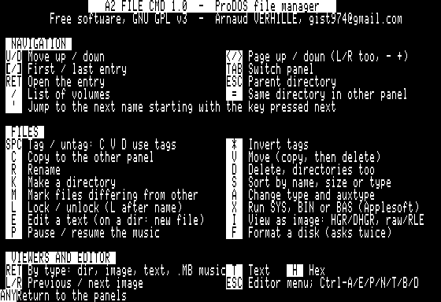

# A2 File Cmd

**Two panels. One Apple II.**

A2FileCmd is a modern two-pane ProDOS file manager for Apple IIe, carrying
forward the spirit of A2Command and Norton Commander. Copy, move, rename,
delete, tag, sort; read texts, dump bytes, edit files; view HGR and
DHGR pictures full screen; play Mockingboard music; format a disk. All of it
in 80 columns, on 128 KB, from a bootable 5.25" floppy.





## Requirements

* Apple IIe **Enhanced** with **128 KB** (the auxiliary bank is not optional:
  the second panel and the DHGR viewer live there)
* **ProDOS 8** — the disk boots on its own, or the program can be started from
  a selector such as Bitsy Bye
* 80-column display
* Optional: a Mockingboard in any slot, for the music player
* Optional: an AppleMouse II card in any slot — click to select, click again
  to open, click a button of the key bar; the keyboard does everything too

## Getting started

Download `A2FILECMD.po` (ProDOS order) or `A2FILECMD.dsk` (DOS 3.3 order —
what ADTPro and most emulators expect for a 5.25" floppy) from the
[latest release](https://github.com/habib256/a2filecmd/releases/latest), boot
it, and press `?` for the full key map.

The left panel opens on the volume, the right one on `DEMO/`, where a few
generated files let you try everything: two test cards for the picture viewer,
a short three-voice fanfare for the Mockingboard, a text for the viewer and the
editor, and an Applesoft program.

| Key | |
|---|---|
| `TAB` | switch panel |
| `Up` / `Down` | move the selection |
| `Left` / `Right` (or `<` `>`, `-` `+`) | one page up / down |
| `RETURN` | open by type: directory, disk image (`.PO`/`.DSK`/`.2MG`, ProDOS or DOS 3.3) as a folder, picture, text, `.MB` music, SYS or BAS program |
| `ESC` | parent directory; from a volume root, the list of on-line volumes |
| `SPACE` | tag a file — `C`, `V` and `D` then work on every tagged file |
| `C` `V` `R` `D` `K` | copy, move, rename, delete, make directory |
| `T` `H` `I` `E` | text viewer (an Applesoft `.BAS` is listed, detokenized), hex viewer, picture viewer, text editor |
| `A` `L` `S` `M` | type and auxtype, lock, sort, mark differences |
| `X` `P` `F` `Q` | run a program, pause the music, format a disk, quit |
| mouse | click a line to select it, click it again to open; click the column header to sort, the path to go up, a key-bar button for its key |

## Building

```sh
make          # the three ProDOS binaries, in build/
make disk     # dist/A2FILECMD.po and .dsk
make test     # everything that does not need an Apple II
```

Needs **cc65** (2.19 or later) and Python 3. Nothing else: the ProDOS volume
writer, the sector-order converter and the demo files are all in `tools/`.

`make bench` plays a full session in an emulator; see
[bench/README.md](bench/README.md).

## What is in here

| | |
|---|---|
| `src/` | the program (`a2fc.c`), its launcher, the formatter, the Mockingboard player, the mouse driver; the picture decoder, the viewers, the editor, the music and program launchers, the delete/attribute commands, the overlay menu, the disk-image tool, the Applesoft lister, and the ProDOS-image, DOS-3.3 and ShrinkIt (`.SHK`) extractors are overlays (`A2FILE/*.PLG`) loaded on demand into `$1B00`, some reaching into `$2000-$3FFF`; a third party can add one against the stable ABI in `src/a2fc_plugin.h` |
| `sdk/` | write your own overlay: [the guide](sdk/README.md), a worked example (`hello.c`), the link config and build script, all against `src/a2fc_plugin.h` alone |
| `tools/` | ProDOS volume writer, sector-order converter, memory-layout checker, demo maker, ShrinkIt (`.SHK`) reader/writer |
| `bench/` | the headless emulator benches |
| `data/` | the help text, the ProDOS boot blocks, ProDOS 8 and BASIC.SYSTEM |
| `docs/` | [the manual](docs/MANUAL.md), screenshots |

## Known limits

* One directory window holds 140 entries; a larger directory is read in
  windows, in disk order, and the header says so.
* Paths are limited to 64 characters, as ProDOS itself is.
* The text editor holds 8 KB — it is for configuration files and notes, not
  for manuscripts.
* A `.MB` music file must be 2304 bytes or less.
* Running a program does not come back: the file manager is overwritten by
  what it launches. The formatter is the exception, it returns.
* **Viewing a DHGR picture or playing a `.MB` tune destroys the contents of
  `/RAM`** — double hi-res, the music stream and the ProDOS RAM disk share
  the same auxiliary memory. A2 File Cmd rebuilds `/RAM` empty (after the
  picture, before the tune starts) and says so, rather than leaving a
  half-overwritten volume behind. Do not write to `/RAM` while a tune plays:
  the tune, not the volume, would be garbled.

## Credits

Written by Arnaud VERHILLE (`gist974@gmail.com`), free software under the
[GNU GPL v3](LICENSE).

The disk also carries **ProDOS 8 2.4.3** and **BASIC.SYSTEM**, freely
distributed for the Apple II community by John Brooks; they are Apple's, not
mine. Everything else on the disk — including the two test cards and the
fanfare — is generated by `tools/mkdemo.py`.

The benches drive [POM2](https://github.com/habib256/pom2), an Apple II
emulator by the same author.

A2 File Cmd grew inside an Apple IIe game and moved out to live on its own;
the game remains one of its users, not its container.
