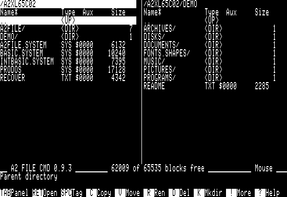
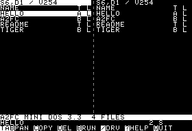

# The A2 File Cmd manual

**Version 0.9.3**. By Arnaud Verhille, GNU GPL v3.



## Contents

- [A2 File Cmd DOS3.3](#a2-file-cmd-dos33)
- [From DOS3.3 to ProDOS](#from-dos33-to-prodos)
- [Keys and panels](#keys-and-panels)
- [Copy, move and edit](#copy-move-and-edit)
- [Recover after an incident](#recover-after-an-incident)
- [Read documents and pictures](#read-documents-and-pictures)
- [Play music](#play-music)
- [Extract archives and run programs](#extract-archives-and-run-programs)
- [Work with disks and images](#work-with-disks-and-images)
- [Find and maintain files](#find-and-maintain-files)
- [Limits, troubleshooting and VDrive](#limits-troubleshooting-and-vdrive)
- [Credits and further reading](#credits-and-further-reading)

## A2 File Cmd DOS3.3



Two panels, a source and a destination: DOS3.3 distils A2 File Cmd into
selecting, reading, editing and verified copying. It uses an **Apple II+ with
48 KB**, NMOS 6502, 40 columns and **two Disk II drives on the boot controller**.
The following chapters extend this workflow with ProDOS folders and tools.

Boot `A2FILECMD-DOS3.3-0.9.3.dsk`, or use **BRUN A2FC** from DOS 3.3. Both panels
start on the boot disk; each remembers drive, selection and scroll. Catalogs
hold up to 105 files and show 19 rows. `?` opens help.

| Keys | Action |
|---|---|
| TAB/Ctrl-I or 1; / or 4 | Switch panels; change active drive. |
| Up/Down or I/K; Left/Right | Previous/next file; previous/next page. [/] first/last. |
| Return or 2; T/H/G; B | Open; force text/hex/hi-res; confirm BRUN. |
| Space; Ctrl-T/N; * | Tag one; all/none; invert tags. |
| C or 3; N/E; D/R/L | Copy; new/edit text; delete/rename/lock. |
| Ctrl-R or 5; = | Reread both panels; same disk opposite. |
| ? or 6; Q or 7; Escape | Help; confirm quit; leave preview/help/editor. |

Questions use **Y** to confirm and **N/Escape** to cancel. Other keys do not
confirm. Escape in the browser has no effect: DOS has no parent directories.
After changing a disk, reread with Ctrl-R. Prompts and the result occupy the
footer; read them before inserting another disk.

### Copy and edit

1. Put the panels on different drives using TAB and `/`.
2. Select/tag the sources and press C. Check `COPY name?` or the marked count.
3. Confirm Y, then wait for the progress bar and final result. **Once started,
   the disk-writing operation cannot be interrupted from the keyboard.**

Copies preserve DOS names, type, lock flag and all data-sector bytes. Existing
names are skipped. Destination sectors are reserved first, written and read
back, then the catalog entry is published. An uncertain write stops the batch;
the source is neither written nor deleted. There is no single-drive copy by
swapping disks.

N/E uses the same exclusive writer. E accepts at most **8 KB** and refuses larger
files rather than truncating them. It always saves to a new name. R refuses an
existing name or locked file. D skips locked files; L toggles the cursor's lock,
or unlocks a tagged set if any member is locked, otherwise locks the set.

### Preview and limits

Return identifies text, hi-res or a binary program from content and DOS headers;
a program asks `BRUN NAME?`. T/H previews only the first 256 stored bytes; G
shows the first 8 KB as hi-res. A valid 8 KB BIN load at $2000/$4000 is a picture;
unsupported or unsafe program headers fall back to hex. BRUN leaves A2FC.

Only standard 35-track, 16-sector DOS 3.3 is supported. Sparse/inconsistent
chains, reserved-track data, 13-sector, 40-track and protected formats are
refused. Before a write, the catalog entry must still match the panel's identity;
a changed disk is refused, though a byte-identical twin cannot be distinguished.
Physical write protection is checked. After an uncertain error, reserved space
is retained and further writes are blocked for that run: preserve and inspect a
copy of the disk. Readback cannot repair metadata damaged by a power failure.

<!-- pagebreak -->

## From DOS3.3 to ProDOS

ProDOS builds on the same two-panel workflow: folders, attributes, archives,
documents, pictures, music and disk tools. It needs an **Apple IIe, //c or IIgs
with 128 KB and 80 columns**. This is a separate program: its commands, plugins
and recovery filenames do not apply to the DOS3.3 edition introduced first.

### Five self-contained images

| Image | Choose it for |
|---|---|
| `A2FILECMD-DOS3.3-0.9.3.dsk` | Standalone DOS 3.3 file manager for Apple II+ and two Disk II drives. |
| `A2FILECMD-140K-0.9.3.dsk` | One 5¼-inch ProDOS disk with essential file operations and text editing; 6502. |
| `A2FILECMD-800K-0.9.3.po` | All ProDOS tools and BASIC runtimes, without the demonstration corpus; 6502. |
| `A2FILECMD-XL-0.9.3.2mg` | Complete 32 MB ProDOS edition with tools and demonstrations; 6502. |
| `A2FILECMD-65C02-enhanced-mouse-XL-0.9.3.2mg` | Complete XL with MouseText and optional mouse support. Requires both 65C02 and enhanced ROM. |

The ProDOS 6502 editions also run on enhanced machines. A 65C02 processor
alone does not make an unenhanced IIe suitable for the enhanced edition;
use 6502 when either the processor or ROM is unsuitable. The launcher checks
machine, processor and memory before starting. Mouse hardware is optional.

140K and DOS3.3 use DOS-sector-order `.dsk`; 800K uses ProDOS-order `.po`.
XL uses `.2mg`. Renaming an extension does not convert an image. With all
release images and the PDF in the same directory, check their downloads:

```sh
sha256sum -c SHA256SUMS-0.9.3.txt
```

### Install and start

Boot the selected image, or launch `A2FILE.SYSTEM` from a ProDOS selector.
When installing elsewhere, keep `A2FILE.SYSTEM` beside the complete `A2FILE/`
directory and copy `RECOVER` too. Keep the program and its native plugins
from the same build and CPU edition; do not mix them.

The 140K disk provides navigation, tags, copy/move/delete, rename and
attributes, text editing, text/hex readers, comparison, formatting, verification
and ProDOS image extraction. Advanced disk tools, DOS extraction, archives,
media players and BASIC runtimes require **800K or XL**. Their menus list the
available tools without asking for category disks. Both complete editions
include all 82 overlays; only XL includes `DEMO/` and its sample media.

### Before working

Use copies of valuable disks. Read each target name before confirming an
operation. Keep space for both old and new versions during replacement.
Do not remove a disk until the operation reports its result.

Some tools use auxiliary memory and rebuild **/RAM empty**. A2FC asks before
that use and explicitly warns that **ALL /RAM files will be lost**. Copy them
elsewhere first; declining preserves them. This applies to affected picture
viewers, ShrinkIt, disk-image operations, Disk II formatting, NIBCOPY and full
large-volume checks. Ordinary text and music readers preserve /RAM.

<!-- pagebreak -->

## Keys and panels

**TAB** changes the active panel. The highlighted row is the cursor; `*` marks
a tagged entry and `L` a locked one. Directories end in `/`. The header's star
shows the sort order. Messages and progress appear below the panels.

| Keys | Action |
|---|---|
| Up/Down; Left/Right or < / > | Move one entry; move one page. [ / ] goes to first/last. |
| Return / Escape / / | Open; parent directory; list volumes. Return asks before running a program. |
| TAB / = / Ctrl-R | Other panel; same directory opposite; reread both panels. |
| Space / * / Ctrl-T / Ctrl-N | Tag one; invert tags; tag all; clear tags. |
| S / M / ' then initial | Change sort; tag size/date differences; jump to a name. |
| C / V / D | Copy; move; delete. Use tags, or the cursor when none are tagged. |
| R / K / A / L | Rename; new directory; type/auxtype; lock/unlock. |
| T / H / I / E / X | Text; hex; picture; edit; run after confirmation. |
| W / F / ! / ? / Q | Disk images; format; tools menu; help; quit after confirmation. |
| 1 … 0 | Activate the corresponding bottom key-bar button. |

Names start with a letter, then letters, digits or periods, up to 15 characters.
Directories can be tagged; `..` cannot. Returning to a parent selects the child
you left if it still exists. Large directories use unsorted windows in disk
order; continue through the window edge to reach later entries.

Enhanced mouse support lets you select a row, click it again to open, click
a path to go up, a header to sort or a key-bar button to act. Prompts, viewers
and the editor use the keyboard. On quit, A2FC saves panel paths, sorting and
active side; a failed preference save lets you cancel quitting.

## Copy, move and edit

1. Open the destination in the other panel. In the source, clear unwanted
   tags with **Ctrl-N**, then select or tag the entries to transfer.
2. Press **C** or **V**. For an existing target: **O** overwrites, **S** skips,
   **A** overwrites all and **N** overwrites none. Check the destination first.
3. Wait for **Copying** and **Verifying**, then read the result. Move removes
   a source only after its copy is verified. Existing directories are filled
   in; copying into the source or its descendants is refused.

Copy preserves type and auxtype. Replacements retain the old target during
verification. **Escape** interrupts; completed work remains. If cleanup fails,
a temporary can remain: use the recovery procedure before retrying. Deep trees
may be refused; process smaller subdirectories rather than bypassing the limit.

**! → Files → MOVE** can relocate a single entry within a volume without
copying its data blocks. A marked batch first reserves `A2MOVE.LST`, refuses
marked directories and stops on error or Escape. Cross-volume copies are
verified before source deletion. Keep any retained work list for review.

**E** edits up to **5,104 bytes**, with CR line endings; loading strips the
high bit and long lines do not wrap. On a directory or `..`, E creates text.
Arrows move; Delete/Ctrl-D erase left/right; Ctrl-A/E goes to line start/end;
Ctrl-P/N changes page; Ctrl-T/B goes to text start/end. Return splits a line;
Tab inserts four spaces. Escape opens **S** save, **X** save/exit, **Q** abandon
(confirm changes), or Escape to continue. Saving preserves type/auxtype and
uses verified `A2FC.EDIT` plus `A2FC.ED.BAK`; existing recovery files block saving.

<!-- pagebreak -->

## Recover after an incident

Every ProDOS disk includes **RECOVER** at its root. Open it with Return; the
`?` help screen points to it. Recovery begins by preserving evidence, not by
retrying the failed operation or deleting the files it left behind.

### Preserve, identify, recover

1. Stop and record the exact error, source path and intended destination.
   Make a disk image or duplicate before changing anything. Work on the
   duplicate and recover onto a separate healthy disk. If reads are unreliable
   and no independent copy is possible, stop and seek help.
2. Keep the target, temporary and backup. A name, date or matching size does
   not prove completeness. A generic `A2FC.BAK` may belong to an earlier
   operation: if its original target is unknown, preserve it without guessing.
3. On the **duplicate only**, rename one identified candidate to an unused
   `RECOV.OLD` or `RECOV.NEW`. This is necessary for `A2FC.COPY`, which C cannot
   copy under that reserved name. Choose another name if it is already taken.
4. Put a fresh recovery directory in the other panel, clear source tags with
   **Ctrl-N**, select the candidate and press **C**. Refuse overwrite. Wait
   for copying **and verification**; an error means recovery is not confirmed.
5. Check the recovered content with its reader, or compare all bytes against
   a known good source. Do not execute an unknown program to test it. Only
   after validation, give the recovered copy its intended name in an empty
   directory. Keep the disk image and other candidates until satisfied.

### Recognize the files

| Operation | New candidate | Previous version |
|---|---|---|
| Copy | `A2FC.COPY` | `A2FC.BAK` |
| Editor | `A2FC.EDIT` | `A2FC.ED.BAK` |
| SYNC | `A2FC.SYNC` | `A2FC.BAK` |
| Text / image conversion | `TXTCONV.TMP` / `IMGCONV.TMP` | `A2FC.BAK` |
| DOS image write | `A2FC.DOS` | `A2FC.BAK` |
| Preferences in A2FILE/ | `A2FILE.TMP` | `A2FILE.BAK` |
| GOTO in A2FILE/ | `GOTO.TMP` | `GOTO.BAK` |

**Target plus backup** can mean installation succeeded but cleanup failed.
**Backup without target** can mean restoration is needed. A **temporary** can
be incomplete or verified but not installed. Preserve the candidates until
checked; absence of a backup does not prove an interrupted write completed.
A reported successful save with a retained backup is distinct from a failed
save. Read the exact message and validate the saved target before cleanup.

For a partial move, compare both sides file by file. **A2MOVE.LST is a work
list, not file contents**: do not replay, edit or delete it as a recovery
shortcut. Copy missing files into a fresh directory and retain remaining
sources. Extraction may leave partial output under its normal filename.

Keep power on for files in **/RAM**; do not reboot or accept AUX reclamation.
A2FC does not infer original names, automatically resume interrupted work or
promise survival of a power cut during physical metadata writes. More failure
cases are documented in [Data safety](DATA-SAFETY.md).

<!-- pagebreak -->

## Read documents and pictures

### Text and documents

**T** reads text; **H** shows offsets, bytes and characters. Space/Return/Down
advances; B/Up goes back; Escape returns. TEXT clips lines at 80 columns and
remembers 96 page starts; **R** restarts it. Use **MDVIEW** for wrapped text
and Markdown, with 64 previous pages and no forward limit. It also reads
extracted Magic Window `.MW` documents. Teach extended files are unsupported.
HEX uses **G** for a seven-digit offset and **R/E** for first/last page.

T lists Applesoft, Integer BASIC and Business BASIC (`.BA3`) without running
them. T/Return reads AppleWorks word-processing text, omitting layout commands.
Return on an AppleWorks database or spreadsheet opens **AWDATA**: Space/Down
and B/Up page, Left/Right moves columns, R restarts, and F switches between a
sheet and cell details. Database TAB shows categories 23–30. Limits are 2,688
records or 882 spreadsheet rows; displayed formulas/results are the saved ones,
not a recalculation. Formats, reports and window settings are omitted.

### Pictures: Return or I

Return and I select the same recognized picture formats on both CPU editions.
Explicit packed types take priority; signatures identify DGR and HGRR/DHRR.
An identification read/close error stops opening. **H** explicitly selects hex.
Specialized viewers and media tools require **800K or XL**.

| Picture or font | Identification / tool |
|---|---|
| Raw HGR / DHGR, HGRR / DHRR | IMAGE; raw pages or version 1 RLE. |
| Lo-res / DGR | DGRVIEW; DGR signature or BIN/FOT with aux $0400. I can ask for a raw sprite width. |
| Extasie / Arlequin | EXTASIE ($F2); ARLEQUIN ($F8 with its signature). |
| MacPaint | MACPAINT; `.MAC`, optionally with a MacBinary header. |
| Packed FOT / LZ4FH | PACKFOT ($08/$4000 or $4001); LZ4FH ($08/$8066). |
| Packed 816/Paint | PAINT816; BIN with aux $E001 or $E002. |
| Purplesoft | PURPLE; matching `.FOTO1` and `.FOTO2` in one directory. |
| Print Shop | PRINTSHOP; 572/576-byte BIN clip art, aux $4800/$5800/$6800/$7800. |
| MGTK or hi-res fonts | FONTVIEW; type $07, or select the tool for an untyped font. |
| Applesoft shapes | SHAPES; `.SHAPE` or choose the tool directly. |

Raw HGR accepts **8,184/8,192 bytes**; DHGR accepts **16,376/16,384**, auxiliary
plane first. Left/Right browses the previous/next file handled by the same
viewer, including across directory windows. At an end it does nothing.
Loading shows the filename; Escape returns to the panels. Ordinary small BIN
files open in hex with Return; I can treat a suitable one as a sprite.

Viewers that need AUX ask **before** writing it and can rebuild /RAM empty.
Consent lasts only for that browsing session; leaving and reopening asks again.
Malformed pictures are refused. LZ4FH, PRINTSHOP, FONTVIEW and SHAPES preserve
/RAM. Keep both Purplesoft companion files; extended EVE modes require compatible
hardware. MACPAINT shows 560 × 192 of its 576 × 720 image; Up/Down pans by 96
lines. SHAPES shows 24 shapes a page, Space/Down next and B/Up previous.

<!-- pagebreak -->

## Play music

Music players are included on **800K and XL**, run in the foreground and preserve
**/RAM**. **P** pauses/resumes, **Escape** stops, and Left/Right selects the
previous/next tune of the same type in the directory. A new track starts
unpaused. A missing card or invalid data produces an error instead of playback.

**MUSIC:** MB1 `.MB`, up to 4,096 bytes, six Mockingboard voices.
**PT3:** up to 65,535 bytes, three voices or standard two-module `02TS`
TurboSound with six. **DUET:** up to 7,168 bytes, type $D5/$D0E7, `.ED`,
or compatible BIN names beginning `M.`.

Mockingboard is detected automatically. A Mockingboard 4c on //c can hide its
mouse firmware: A2FC then keeps keyboard navigation and disables mouse calls
until that firmware is restored by reset. A plain //c without the card is
unaffected. PT3 keeps its source disk open: leave it mounted. Slow reads and
large dual modules can delay playback; 50 Hz is not guaranteed for every tune.
Unsupported effects, invalid pointers and I/O errors stop the player.

DUET uses the speaker when no Mockingboard is present. **1/2** switches
speaker/card; **D** cycles speaker pulse width. Keys take effect at the next
record on the speaker. Files are validated before playback; FIXTYPES can
review old extracted DUET files without changing their content.

## Extract archives and run programs

### Extract into the other panel

Open the destination first, select the archive and choose its tool in **!**.
Return also recognizes common archive suffixes. Existing names are not replaced.

**UNSHRINK:** `.SHK`, stored/LZW1/LZW2 data and disk images; unsupported
members and resource forks are skipped and reported. **BINARY2:** `.BNY/.BQY`,
whose compressed members may need another extraction. **SCIIBIN:** `.BSC/.BSQ`
with ordered parts and CRC checks. **UNSQ:** `.QQ/.ACU`, directories skipped
and paths flattened. **UNWRAP:** AppleSingle/MacBinary data forks, with omitted
resource forks reported.

ShrinkIt requires permission to clear /RAM and refuses it as the destination.
Escape cancels between blocks. Outputs are read back; errors stop the operation.
Cleanup removes only the current new output, where possible; earlier completed
files remain. A retained partial file is reported and blocks retry under that
name. Preserve it until inspected. Do not assume unsupported or skipped members
were recovered; ACU lengths are checked because its stored CRCs are unreliable.

### Run a program

Return runs BAS, INT or SYS after confirmation; **X** also runs BIN. The program
replaces A2FC and does not automatically return. T lists BASIC without running.
800K/XL include `BASIC.SYSTEM` and `INTBASIC.SYSTEM`; keep the selected program
online while its runtime loads. BIN must load from $0800 and end below $BB00.
A failed preference save asks whether to run anyway. The confirmation shows
A2FC's full return command: from BASIC's `]` prompt, reinsert its disk and use
that command, or `BYE` to the ProDOS selector. Shorten BAS paths over 46 characters
if launch fails. Integer BASIC's runtime supports only a subset of DOS commands.

<!-- pagebreak -->

## Work with disks and images

### Browse and extract

Return opens supported ProDOS or DOS 3.3 images as folders: PO, DSK/DO, 2MG
and supported DiskCopy 4.2 containers. HFS is not supported. Escape at the root
leaves the image. **C** extracts the selection or tags to the other panel.
ProDOS extraction supports seedling/sapling files up to 128 KB; enter each
subdirectory separately. Existing targets are refused; incomplete outputs are
removed where possible and failed cleanup is reported.

A physical DOS 3.3 disk appears in **/** with slot/drive. C extracts to ProDOS
on 800K/XL. BIN/BAS/INT headers and sector padding are removed according to the
header's exact length; BIN retains its load address, BAS uses $0801. TXT keeps
sector data. Leave through **/** before opening a changed disk again.

### Add or replace files

**IMGPUT:** open a ProDOS image opposite a selected source and press C, or
choose **! → Disks → IMGPUT**. It copies only the cursor file, ignoring tags;
V refuses. The image needs a free directory slot and enough free blocks.
Files above 128 KB and directory growth are unsupported. Data is verified
before allocation metadata is installed; interrupted writes can reserve space.

**DOSWRITE:** with a real DOS disk opposite, C confirms source name, slot and
drive. TXT/BIN/BAS/INT up to 65,535 bytes are supported, one cursor file; existing
names are refused. The source must be on another device. **DOSREPL** replaces
an existing DOS file using free sectors, verifies it, then switches its catalog
entry; allow room for both copies. **DOS33W** deletes or renames after confirming
the named file and drive. Locked files and inconsistent allocation are refused.

These tools require 800K/XL and standard 35-track, 16-sector DOS disks on a
Disk II in slots 1–7. They check physical protection and allocation before
writing. A failed write can leave reserved sectors; preserve the disk before
further work. Physical VTOC/catalog writes are not atomic.

For a **DOS image**, C supports DSK/DO and DOS-order 2MG. The tool copies the
whole image to `A2FC.DOS`, validates and modifies that copy, then installs it
with `A2FC.BAK` protecting the old image. Allow space for a second full image.
Protected containers and existing recovery names are refused. Keep reported
recovery files; the source file is never deleted.

### Whole disks, formatting and physical copies

**W** writes an image to a formatted disk, reads a disk into a new image, or
copies disks. PO, DSK/DO and 2MG are supported. Choose the same source/target
drive for exchanges. Each prompt identifies SOURCE or TARGET and slot/drive.
Writes require **ERASE**, refuse the program disk and verify each block.
**F** formats the named drive after ERASE; Escape cancels beforehand. Disk II
formatting clears /RAM with consent and refuses to run from /RAM.

**NIBCOPY** copies standard Disk II tracks with one or two drives at normal
1 MHz speed. Write-protect the source first. Accept AUX use only after saving
/RAM, then confirm destruction of **all target files, including locked files**.
Single-drive mode requires target confirmation after every exchange. Each source
track is read twice and the written track verified; Escape stops between tracks.
An incomplete target is not a valid backup. Nonstandard/protected, 13-sector,
half-track and weak-bit formats are unsupported; this is not a flux copier.

**PASCAL** and **CPM** extract supported images into the other panel without
modifying the source. Names are adapted to ProDOS; existing targets are skipped.
Pascal text retains its header/padding. CP/M data is rounded to 128-byte records;
text ends at $1A. Unsupported directory layouts are refused. Use **IMGCONV**
for container conversion, not extension changes. No physical-write operation
promises rollback through a power failure.

<!-- pagebreak -->

## Find and maintain files

Press **!**, choose a category, then a tool. Return opens; Escape goes back.
Up/Down moves one entry, Left/Right six, and an initial jumps by name.
Categories describe tasks; no category disk swap is needed. Except COMPARE,
VERIFY and MOVE, the tools below require **800K or XL**. Read each result,
especially partial scans, skipped files and failed cleanup.

### Files and navigation

- **COMPARE / CRC / VERIFY:** compare opposite namesakes byte for byte;
  calculate CRC-32; read files or volume blocks and report errors.
- **TAGPAT / SEARCH / FIND:** tag by pattern; search current-directory text;
  search a volume by name or contents (`"` prefix). FIND: TAB filters, N pages,
  Return jumps and V shows text matches.
- **GOTO:** P opens a path; A adds a favourite, D + digit removes, M + two
  digits reorders, 1–9 jumps.
- **RENAME / DATE / TXTCONV:** batch names; modification dates; CR/LF/CRLF,
  high-bit, tabs or UTF-8 accent conversion. Conflicting names are preserved.
- **IDENT / FIXTYPES:** identify formats; confirm attribute changes individually.
  Hints do not prove a damaged file is valid.
- **SYNC / TREE:** copy missing/newer files recursively; show directory sizes.

TAGPAT uses `=` for any string and `?` for one character; comma filters include
`T04`, `>2000`, `<2000` and `D` (today). T adds tags, U removes, X replaces.
GOTO paths are at most 63 characters. DATE accepts `DDMMYYYYHHMM`, 1940–2039;
creation dates remain unchanged. SYNC preserves destination-only and newer
files, refuses overlapping trees and stops if replacement/recovery fails. An
unknown source date does not authorize replacement. Keep `A2FC.SYNC/A2FC.BAK`.

### Volumes and recovery

**VOLINFO** audits space, allocation and fragmentation: M bitmap, F file blocks,
E export, N/P pages. Partial counts are unconfirmed; only a complete export ends
with `END REPORT`. **VOLNAME** renames a volume and updates affected paths;
a name already online is refused. **MKIMAGE** creates an empty PO/2MG data
volume, without a boot program, up to 32,767 blocks.

**FIXIT only reads.** It reports ProDOS directory/allocation faults and refuses
incomplete scans rather than declaring lost blocks. For volumes above 4,096
blocks, Q checks directories only; F performs a full scan requiring AUX consent.
A quick clean verdict is not a full allocation check. It does not check DOS disks.

**REPAIR** shows a plan and requires **F**, then **FIX**, before writing. It
refuses the program volume, cross-links and uncertain scans; some damaged files
also prevent freeing unclaimed blocks. Writes are read back, restoration is
attempted on error, and the volume is rescanned. Backups are only in RAM:
interruption can leave a partially applied plan. Large scans can take minutes.

**UNDELETE** recovers validated deleted files to another volume without changing
the source. Reused/ambiguous allocation, deleted directories and resource forks
are refused. **RESCUE** retries reads and zero-fills unreadable chunks, recording
losses in `BASE.LOG`. File output is `BASE.REC`; volume parts `BASE.P01`, `.P02`,
etc. must be concatenated in order. Partial output remains. Inspect the log and
recovered contents: neither tool guarantees recovery of missing data.

**WIPE F** checks allocation before zeroing free blocks; **W** destroys an entire
volume after ERASE, excluding the running program's volume. **BOOTBLK** copies
boot blocks after confirmation, with readback and RAM-only originals for attempted
restoration. **BLKVIEW** reads blocks and can extract a range; **DISASM** reads
6502/65C02 instructions and exports text. Their exports can remain partial after
an error. None of these tools should be tried first on an irreplaceable disk.

<!-- pagebreak -->

## Limits, troubleshooting and VDrive

### Read the status before acting

Long copies distinguish **Copying** from **Verifying**; the verification counter
starts again at zero. Every long tool shows a bar or, where none fits, turns
a `/` `\` mark at the end of the line above the messages (DOS3.3: the last
cell of the key bar). One blocking disk call can still pause it: reading a
diskette that was never formatted retries for a few seconds inside a single
call. Do not remove media just
because a counter has stopped; record the screen and wait for a result or a
safe cancellation point.

Escape cancels where the active tool permits it. Completed work remains and
partial output may require recovery. A result that reports skipped, unsupported,
unreadable or retained files is not a fully successful batch. Check the actual
message before retrying or cleaning up.

| Symptom | Action |
|---|---|
| Startup refusal | Choose the matching CPU/ROM edition; ProDOS needs 128 KB and 80 columns. |
| Missing/stale tool | Use 800K/XL and matching program/plugins. |
| Old catalog or a large directory | Ctrl-R rereads; cross window edges beyond 139 entries. Large windows use disk order. |
| Deep traversal refused | Work on smaller subdirectories; an incomplete tree must not be deleted. |
| Temporary/backup blocks retry | Preserve candidates and follow incident recovery. |
| Run or image opening fails | Check paths, runtime, type and actual container; renaming extensions does not convert. |

### Boundaries to keep in mind

A matching size/date does not prove a recovered file complete: COMPARE checks
bytes, M only compares size/date. Unsupported forks or storage may be refused
or skipped with a report. AUX consent clears /RAM without backing it up.
Verification cannot make physical metadata writes atomic across a power cut.

### VDrive: remote volumes

A detected Super Serial Card or //c serial port can expose two remote ProDOS
volumes at **115,200 bps**, with slot 2 tried first. Use ADTPro's virtual-drive
server, `veserver.py` or `surl-server`. The status line identifies the serial
interface and assigned drives; browse and copy as with local volumes. The host
supplies date/time during reads. A disconnected server produces an I/O error;
it is not an empty or absent file. The driver is removed on quit or program launch.

For reproducible failures, note the A2FC version/edition, machine, disk type,
full paths, exact message and actions. Keep a disk image before any repair.
The project's issue tracker and detailed data-safety notes are linked in the
last chapter. Automated emulator tests do not replace trials on physical drives.

<!-- pagebreak -->

## Credits and further reading

A2 File Cmd is **GNU GPL v3** software by **Arnaud Verhille**. Its two-panel
interface draws inspiration from A2Command and Norton Commander. Code provenance,
source notices and redistribution terms remain in the repository and LICENSE.

### Acknowledgements

- **cc65 / Oliver Schmidt:** toolchain and Apple II startup sources.
- **Colin Leroy, a2tools / Ammonoid:** serial virtual-drive approach and glue.
- **Jerry Hewett and Gary Desrochers:** public-domain Hyper-FORMAT routines,
  carried by ADTPro and adapted for Disk II formatting.
- **Apple ProDOS references:** filesystem, MLI, paths and allocation rules.
- **Paul Lutus:** Electric Duet format and original player; **Alex Patalenski**
  and **Emil Dotchevski:** improved speaker player and its published listing.
- **Cybernesto, electric-mock:** DUET's Mockingboard rendition;
  **Vince Weaver, pt3_lib:** PT3 player work adapted by A2FC.
- **Andy McFadden, CiderPress II:** format notes and real reader test samples.
- **NuLib / ShrinkIt references:** NuFX and Binary II specifications.
- **David Schmidt, ADTPro:** disk-transfer and virtual-drive workflows.
- **POM2 / Arnaud Verhille:** separate emulator for repeatable tests.

The complete attributions, reference URLs and source-file notices are preserved
in [Credits and provenance](CREDITS.md). Keep that document, the affected source
notices and LICENSE when redistributing a modified build. Generated demo media
are identified separately from third-party samples; `data/CP2/README.TXT`
describes the CiderPress corpus.

### Where to go next

- **After an incident:** open `RECOVER` on the program disk and follow this
  guide's recovery chapter before retrying or deleting anything.
- **Failure coverage:** [Data safety](DATA-SAFETY.md) describes temporary names,
  retained originals, error handling and physical-write limits.
- **Real machines:** [Hardware checklist](HARDWARE-CHECKLIST.md) covers disposable
  test media and records the actual machine/drive results.
- **DOS3.3 internals:** [Developer guide](MINI-DOS33.md) holds implementation,
  build and timing details removed from this concise user guide.
- **Media:** [Sample media](SAMPLE-MEDIA.md) documents test material and sources.
- **Builds and extensions:** the repository README, `sdk/README.md` and
  `bench/README.md` describe development and test workflows.
- **Bugs and source:** [A2 File Cmd on GitHub](https://github.com/habib256/a2filecmd).

This is the guide for **0.9.3**. It describes supported behavior and
limits; it is not a claim that physical hardware qualification has finished.
Keep original disks safe, use matching program/tools, and read each operation's
result before starting the next one.
