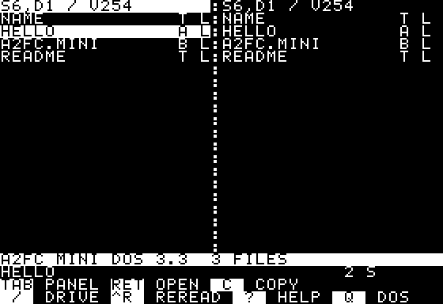

# The A2 File Cmd manual

**Version 0.8.9** — A two-panel ProDOS file manager for an Apple II with
128 KB and 80-column support. Free software by Arnaud Verhille, under GPL v3.

This manual describes two programs that share a name, a version number and
a way of working, but nothing else:

- **A2 File Cmd for ProDOS** — every section from *Start here* to *Limits
  and troubleshooting*. Apple IIe, //c or IIgs with 128 KB and 80 columns,
  ProDOS 8, overlays and plugins, floppy and XL editions.
- **A2FileCmd Mini DOS3.3** — [its own section](#a2filecmd-mini-dos33),
  near the end of this manual. Apple II+
  with 48 KB, DOS 3.3, 40 columns, two Disk II drives, one disk, no
  overlay, no plugin. Nothing written about the ProDOS edition applies to
  it.


## Start here

All floppies use **6502** code and run on an original or enhanced IIe. For
XL, choose **6502** for an original IIe, or **65C02** for an enhanced IIe or
//c with optional AppleMouse II support.
Real-hardware validation on Apple //c, enhanced IIe and unenhanced IIe was
confirmed successful by the maintainer on September 12, 2026.
The IIgs has not been tested. The launcher checks the CPU and memory before
starting and identifies the edition on its title screen.

### Choose your disks

| Edition | What to use |
|---|---|
| **6502 floppies** | BOOT plus whichever 140 KB category disks you need: FILES, MEDIA, DISKTOOLS, DEVTOOLS. These floppies also run on enhanced machines. |
| **XL 6502 or 65C02** | One bootable 32 MB `.2mg` with all 66 overlays, BASIC.SYSTEM, INTBASIC.SYSTEM and demonstration files. No companion disk is needed. |

The download names include the CPU, category and version:

| Role | Image name |
|---|---|
| Boot | `A2FILECMD-6502-BOOT-0.8.9.dsk` |
| Files | `A2FILECMD-6502-FILES-0.8.9.dsk` |
| Media | `A2FILECMD-6502-MEDIA-0.8.9.dsk` |
| Disk tools | `A2FILECMD-6502-DISKTOOLS-0.8.9.dsk` |
| Development tools | `A2FILECMD-6502-DEVTOOLS-0.8.9.dsk` |
| Complete, 6502 | `A2FILECMD-6502-XL-0.8.9.2mg` |
| Complete, 65C02 | `A2FILECMD-65C02-XL-0.8.9.2mg` |

**A2FileCmd Mini DOS3.3** is a different program for a different machine and
ships as one more file, `A2FC-MINI-DOS33-0.8.9.dsk`, a DOS 3.3 disk for an
Apple II+; see [its section](#a2filecmd-mini-dos33).

All floppies are 6502 and supplied as `.dsk` in DOS sector order; XL uses `.2mg`.
Use the downloaded files directly: changing an extension does not convert an image.
Each floppy image is 143,360 bytes. Check downloads against
`SHA256SUMS-0.8.9.txt`; if all release files are together, run:

```sh
sha256sum -c SHA256SUMS-0.8.9.txt
```

Boot the image, or launch `A2FILE.SYSTEM` from a ProDOS selector. To install
elsewhere, keep `A2FILE.SYSTEM` beside its complete `A2FILE/` directory.
Do not mix `A2FILE.CODE` and native plugins from different builds.

### Read the panels

The highlighted panel is active; **TAB** switches sides. Each panel shows
names, file types, auxiliary types and sizes. The selected row is highlighted,
a star marks a tagged entry, and **L** marks a locked one; both marks sit in
the same two columns on every line, a directory's included -- a directory
carries a tag like a file. A directory still shows the slash after its name,
and `<DIR>` stands where a file shows its type.
The header's star identifies the sort order. Below the panels are free space, selection details,
messages and the key bar. **?** opens the help screen.

The program remembers panel directories, sorting and the active side in
`A2FILE/A2FILE.CFG` when you quit. Saving reserves an exclusive temporary file, verifies every
byte after closing it, retains the old file as a backup during replacement,
and verifies the installed file before removing that backup. A warning lets
you cancel quitting if saving fails. Existing `A2FILE.TMP` or `A2FILE.BAK`
files are preserved for recovery. This is not power-fail atomicity.
On the first XL start, the right panel
opens `DEMO/`; try its text, pictures, music and sample archives.
`DEMO/CIDERPRESS/` holds real files from CiderPress II's test data, one or
more for each format that only a real file shows well (MacPaint, AppleWorks
data bases and spreadsheets).

### The companion floppy and disk swaps

The companions group tools by function. Every disk also carries MENU and the
full command catalog. The distribution is declared in `config/packages.mk`.

| Category | Plugins | ProDOS volume |
|---|---|---|
| **FILES** | DOSGET, DOSWRITE, DOSIMAGE, DOSPUT, EDIT, SEARCH, AWP, AWDATA, BINARY2, UNSHRINK, UNWRAP, SCIIBIN, UNSQ, FIND, FIXTYPES, GOTO, MDVIEW, RENAME, SYNC, MOVE, TREE | `/A2FILES6502` |
| **MEDIA** | IMAGE, MUSIC, DGRVIEW, EXTASIE, ARLEQUIN, MACPAINT, SHAPES, PACKFOT, PAINT816, PURPLE, LZ4FH, PRINTSHOP, FONTVIEW, PT3, DUET | `/A2MEDIA6502` |
| **DISKTOOLS** | DOS33W, DOSREPL, BOOTBLK, BLKVIEW, BLKEDIT, DISKCMP, NIBCOPY, IMGCONV, MKIMAGE, RESCUE, UNDELETE, VOLNAME, VOLINFO, FIXIT, REPAIR, WIPE | `/A2DISKS6502` |
| **DEVTOOLS** | PASCAL, CPM, BASLIST, DISASM, INTBASIC listings, CRC, IDENT, plus BASIC.SYSTEM and INTBASIC.SYSTEM runtimes | `/A2DEVTOOLS6502` |

BOOT keeps the essential file manager and disk operations. Use the **same
release** for all floppies. XL is complete; never replace its 65C02 native
plugins with the 6502 companions.

With two Disk II drives, keep BOOT in **slot 6, drive 1** and put the required
category in **slot 6, drive 2**. The **!** menu lists every command; an absent
tool's description starts with the volume containing it.

With one drive, choose the tool normally. If a disk is missing, the prompt
names the required volume, slot, drive and file. Press **1** or **2** to
choose the drive, insert the named disk, then press **Return**. If the input
file was on the removed disk, a second prompt asks for that disk. **Escape**
cancels and returns to the panels. The chosen drive is remembered for the
session; these plugin-loading prompts use slot 6.

BOOT is `/A2FC6502`; the complete disks are `/A2XL6502` and `/A2XL65C02`.
The menu retains every command when companions are absent. Tools that need both
source and destination online still require another drive or volume.
**DISKCMP S** and **W → Copy** have their own single-drive exchange modes.

### Protect files in /RAM

**Copy anything important out of `/RAM` before displaying DHGR,
extracting ShrinkIt, using disk-image operations or physically
formatting a Disk II floppy.** These operations use auxiliary memory and
can rebuild `/RAM` empty. A warning explicitly says that ALL `/RAM` files
will be lost and asks for consent **before** AUX is used. Declining preserves
its contents. The viewer may ask even for a plain HGR file because the same
viewer can browse subsequent DHGR pictures; plain HGR itself does not need
the reconstruction. The message line reports a reconstruction afterwards.
The foreground MB1, PT3 and Electric Duet players preserve `/RAM`.

Returning to a parent with **Escape** or **Return on ..** selects the child
you just left, including when it lies beyond the first directory window.
The child is located by its current name, so an obsolete index cannot select
an unrelated entry. If it has disappeared, the parent opens at its beginning.

## Keys

| Key | Action |
|---|---|
| **Up / Down** | Previous / next entry. |
| **Left / Right**, **< / >**, **- / +** | Previous / next page; **[ / ]** jumps to first / last entry. |
| **TAB / =** | Switch panel / show the same directory in the other panel. |
| **RETURN / ESC / /** | Open / go up / list volumes. Return asks before running a program. |
| **'**, then letter or digit | Jump to the next name with that initial. |
| **SPACE / \*** | Toggle the selection's tag / invert all tags. Directories can be tagged; `..` never is. |
| **Ctrl-T / Ctrl-N / Ctrl-R** | Tag all / untag all / reread both panels. |
| **S / M** | Change sorting / tag files absent or different in size/date in the other panel. |
| **C / V** | Copy / move tagged entries, otherwise the selection, to the other panel. Includes directories. Move deletes originals after copying. |
| **D** | Delete tagged entries or the selection, including directory contents, after confirmation. |
| **R / K** | Rename / create a directory. Names: letter first, then letters, digits or periods; maximum 15 characters. |
| **A / L** | Change hexadecimal type/auxtype / lock or unlock. Locked files refuse deletion, renaming and writing; the other access bits (read, backup, invisible) are kept. |
| **T / H / I** | Read text / hexadecimal / picture. T also lists BAS and AWP files. |
| **E** | Edit text; on a directory or `..`, create a text file. |
| **X** | Run a program after confirmation, replacing A2FC. |
| **W / F / !** | Disk-image operations / format / plugin menu. |
| **? / 1 … 0 / Q** | Help / key-bar buttons / quit to ProDOS after confirmation. |

Copying preserves name, type and auxiliary type. For an existing target,
choose **O** overwrite, **S** skip, **A** overwrite all or **N** overwrite
none. Existing destination directories are filled in. Copying into the same
or a nested source directory is refused. Files are read back and compared
before a move can delete its source. Overwrites protect the old destination
as `A2FC.BAK`; failures attempt to restore it. A leftover backup must be
examined before another replacement. Archive and image extraction refuse
existing output files instead of silently overwriting them.

Very deep trees can exceed the recursive working space. A2FC checks the
remaining stack before directory I/O and refuses an unsafe traversal with
`Directory unreadable or too large/deep.` Copy/move counts the tree before
transferring it; directory deletion also scans it before the first removal.
Copy or delete smaller subdirectories separately if needed.

Long operations display progress, including each item during recursive deletes.
**ESC** interrupts; completed work remains,
an incomplete ordinary file copy is removed, and the final message reports
what was done. Read the result before removing a disk.

### The mouse

On 65C02, an AppleMouse II supplements the keyboard. Click a row to select
it; click the selected row again to open it. Click a path to go up, a column
header to change sorting, or a key-bar button to invoke it. Viewers, the
editor and prompts use the keyboard.

## More tools in the ! menu

Select the item first, press **!**, choose a category and press **Return**,
then choose its tool and press **Return**. Categories are Files, Images, Music,
Disks, Programming, System, Archives and Other (third-party tools).
**Escape** returns to the category list, then to the panels. Tools are sorted
by name within each category. **Up/Down** moves a
line, **Left/Right** moves six lines (stopping at the list ends), and a
letter jumps to a matching initial.
Questions on the penultimate line appear in inverse video while awaiting a
response, including typed names, confirmations, conversion choices and disk
swaps. Ordinary information and results remain in normal video.
The following tools supplement the main keys and readers.

### On BOOT and XL

| Tool | Operation |
|---|---|
| **COMPARE** | Compare the selected file byte by byte with the same name in the other panel. |
| **TXTCONV** | C = CR, L = LF, D = CRLF, H = clear high bit, S = set it, T = expand tabs, A = transliterate UTF-8 accents; incomplete sequences become `?` without consuming following text. Write in place or to the other panel. In-place conversion preserves the source on incomplete reads or changed size and refuses an existing TXTCONV.TMP. |
| **DATE** | S sets date/time from `DDMMYYYYHHMM` (1940–2039); impossible dates are rejected. F stamps modification dates on tagged files or the selection. Creation dates stay unchanged; a hardware clock may replace the entered time. |
| **VERIFY** | Read tagged files (skip directories), the selection, or every block of a volume. Report processed files and errors; ESC cancels. No writes. |
| **TAGPAT** | Name patterns: `=` any string, `?` one character. Add comma-separated filters: `T04` TXT, `>2000` or `<2000` bytes, `D` modified today. T tags, U untags, X replaces tags. |
| **WIPE** | F checks live directory/file references against the bitmap before zeroing free blocks. Unreadable, inconsistent or unsupported allocation is refused. W zeroes the whole volume after `ERASE`; the running program's volume is refused. |

### On category disks and XL

VOLINFO, FIXIT, REPAIR and VOLNAME are on DISKTOOLS; the menu requests that disk when necessary.
Menu categories describe tasks and do not require changing disks just to browse.

| Tool | Operation |
|---|---|
| **VOLINFO** | Audit allocation and fragmentation. M = bitmap (`.` free, `#` used), F = selected file blocks, E = export to the other panel. N/P pages; ESC returns. No repairs. |
| **FIXIT** | Check a ProDOS volume and name each fault: header, directory chains and parents, entry names, access bits, key and index pointers, file and directory counters, cross-linked, lost and wrongly marked blocks. One line per check with its count and first block; 18 lines a page, a key continues. R scans again after a disk change; ESC/Return leaves. On a volume above 4,096 blocks it first asks for **Q** (quick: directories only) or **F** (full), then whether /RAM may be lost. FIXIT only reads: it writes nothing and repairs nothing. REPAIR is the tool that writes. |
| **REPAIR** | Repair a ProDOS volume. It walks the volume itself, shows a plan -- one line per check with the number of corrections, plus what it refuses and why -- and writes nothing until `F` is pressed and the word FIX typed in full. It repairs eleven faults: in the bitmap, blocks a file uses but the bitmap calls free, reserved blocks marked free, bits set past the end of the volume and blocks nobody claims; in the directory tree, a header's file count, a file's or a subdirectory's blocks used, a subdirectory's eof, an entry's pointer back to its own directory, the three parent fields of a subdirectory header and a directory block's back-pointer. Every block written is read back and compared; a block that cannot be verified has its original rewritten and verified. The volume is then walked again and the verdict says what that second pass found. |
| **VOLNAME** | Rename a ProDOS volume and update the affected panel/program paths. A name another online volume already has is refused ("Name in use."): ProDOS itself would accept it, and two volumes would then answer to one path. |
| **SEARCH** | Find text in the active directory and tag matching files, ignoring case. ESC cancels a long scan and keeps tags already found. |
| **FIXTYPES** | Review and confirm type/auxtype repairs on tagged files or the selection. Recognizes validated DUET content with a name/type hint and explicit suffixes; optional suffix removal. DUET names, image suffixes and `.SYSTEM` stay. |
| **GOTO** | P opens a typed `/VOLUME/DIRECTORY` path (63 characters max; Delete/Left edits, ESC cancels). Nine favourites: A adds, D then a digit removes, M then two digits reorders, 1–9 jumps. Saved in `A2FILE/GOTO.CFG`. |
| **FIND** | Search the volume by name pattern; start with `"` to search contents, ignoring case. TAB sets type (T, two hex digits) and modification dates (D, inclusive YYYYMMDD, 1940–2039); A clears filters. Undated files are excluded by date filters. N shows the next 20 results; Return jumps there. V on a text result shows occurrence offsets (hex) and excerpts; N/Space continues, ESC returns. |
| **BLKVIEW** | Read device or image blocks: H hex/ASCII, D directory, I index, N/P block, Space page, G four-digit hex block, F find four bytes (8 hex digits), A find next, X extract blocks, ESC back. Source stays unchanged. |
| **ARLEQUIN** | View ARLEQUIN/Chat Mauve ProDOS `$F8` pictures, full screen or windows. `Return` and `I` select it when the file carries Arlequin's signature. |
| **EXTASIE** | View Extasie/Chat Mauve ProDOS `$F2` images. The original count/repeat stream is decoded into the HGR page; ESC returns to the panels. `Return` and `I` select EXTASIE automatically on both processors. |
| **DISASM** | Read BIN/SYS as assembly: N/Space next, P previous (last 64 pages), C 6502/65C02, G seven-digit file offset, L four-digit CPU load address, R start, E export, ESC back. BIN uses its auxtype; SYS starts at $2000. |
| **CRC** | Calculate CRC-32 for the selection or tagged files. Results appear in pages of 20; a key continues, ESC at a page boundary stops the batch. |
| **IDENT** | Identify supported music, picture, font, archive, program and disk families from headers, attributes or names; DUET candidates are read completely. Text statistics cover the first 512 bytes. |
| **MDVIEW** | Wrapped Markdown/text; no forward limit. Up: last 64 pages. R: restart. |
| **RENAME** | Batch prefix, suffix, extension replacement/removal or numbering. For example E then BAK sets `.BAK`. Conflicts are skipped. |
| **IMGCONV** | Convert PO/HDV, DSK/DO, 2MG and DiskCopy 4.2 (C; `$E0/$8005`, 400K/800K/720K/1440K only) into the other panel, preserving disk blocks. A DiskCopy source is checked against its own checksum before anything is written; its tag bytes are not converted. Unsupported 2MG formats, block counts exceeding 16 bits, and data ranges inside the header or beyond the source size are refused before destination access. Read or seek failures abort conversion and attempt to remove incomplete output; failed cleanup is reported. |
| **BOOTBLK** | Copy ProDOS boot blocks from the boot volume to another volume after confirmation. Saves both originals in main memory, verifies writes and restores both blocks on error. An incomplete restoration is reported explicitly; the backup does not survive a power cut. |
| **UNDELETE** | Browse deleted ProDOS entries. N skips; R recovers a validated candidate to another online volume. Existing names are refused. |
| **NIBCOPY** | Physical Disk II copy, one or two drives. Copies 35 standard 16-sector tracks, retaining encoded fields and sector order, regenerating sync gaps, and verifying each track. Requires a write-protected source and prior AUX/target confirmations. |
| **DISKCMP** | V compares online ProDOS volumes; I compares images; S compares two Disk II disks on one drive. Reports differing blocks and the first mismatch. |
| **MKIMAGE** | Create an empty ProDOS PO or 2MG: 140 KB, 800 KB, 2/4/8 MB or 32,767 blocks. New images are data volumes, without a boot program. |
| **RESCUE** | F recovers a file; V recovers a ProDOS volume. Uses up to 30 attempts per block, zero-fills unreadable chunks and writes a LOG. Destination must be another online volume. |
| **SYNC** | Recursively copy missing or newer files to the other panel after confirming direction. Destination-only files remain; copies are read back before replacement. |
| **MOVE** | Move marked entries, or the selected entry without marks. Within a volume, move without copying data blocks, directories included; locked sources are refused. Every path component must still be a directory. A full subdirectory grows if space is available; damaged parent references are refused before writing. Across volumes, a file is copied and verified before its source is deleted; existing destination names are refused, and a size mismatch preserves the source and removes the incomplete copy (if that removal fails, the message says the partial copy stays). A directory bound for another volume, marked or under the cursor, is walked like V does: counted, copied and read back file by file, and its source deleted only once every file has arrived; a copy that stops, or a skipped file, keeps the whole source and stops the batch. Available on FILES and XL. |
| **TREE** | Show file sizes and cumulative directory totals. Space advances a page; ESC exits. |

### Recovery and comparison limits

COPY writes `A2FC.COPY` in the destination directory and verifies its closed
contents before replacing the previous destination. Failed cleanup can leave
an incomplete temporary; failed installation keeps the verified temporary.
If rollback fails, the previous destination remains in `A2FC.BAK`. Inspect
these recovery files before renaming or deleting them. Existing recovery
files are never overwritten, and `A2FC.COPY` cannot be used as the final copy
name. No source deletion is authorized after failure, including failed cleanup
after cancellation. A power cut can still interrupt physical directory writes.

SYNC stops before processing the next file when installation or recovery
cannot finish. Its diagnostic remains visible. Check `A2FC.SYNC` (the new
result) and `A2FC.BAK` (the previous destination, if moved aside) in the
corresponding destination directory. A failed install retains the verified
temporary even if the original was restored. A failed cleanup after copying
can leave an incomplete temporary. Inspect recovery files before removing or
renaming them; retrying does not overwrite them. Source files remain intact.

TXTCONV and IMGCONV report failed cleanup explicitly: the output may remain
incomplete, and retrying does not overwrite an existing temporary file.
Check `TXTCONV.TMP` or `IMGCONV.TMP` in the destination directory (the source
directory for in-place text conversion), or the output name when creating a
new file. If restoration fails, the original remains in `A2FC.BAK` and the
converted result remains in the temporary file. Inspect these files before
renaming or removing them. A retained backup after successful conversion is
reported separately. These recovery steps do not provide power-loss atomicity.

**UNDELETE never changes the source directory, indexes or bitmap.** It checks
retained pointers, block counts, free blocks and index halves swapped by
ProDOS DESTROY. An interrupted DESTROY can leave a deleted entry with damaged
allocation information: the deleted marker alone is insufficient. Reused,
inconsistent or ambiguous candidates are refused. Standard seedling, sapling
and tree files, including sparse files, are supported; deleted directories
and resource forks are not. Inspect recovered data before relying on it.

**RESCUE** writes `BASE.REC` for a file. Whole-disk recovery writes raw ProDOS
parts `BASE.P01`, `BASE.P02`, etc., up to 16,000 blocks each. Concatenate them
in numeric order for a PO image; a single part can simply receive `.PO`.
`BASE.LOG` records zero-filled chunks and completion or interruption. Partial
output stays after cancellation or a write failure.

**SYNC** skips equal-date or newer destination files. A source with an unknown
date does not replace an existing file. It uses `A2FC.SYNC` temporarily and
`A2FC.BAK` for rollback, preserving pre-existing files with those names.
Verification requires matching contents and exact length; a size mismatch
preserves the source and existing destination and removes the temporary copy.
If replacement fails, the original is restored where possible; keep any
remaining `A2FC.BAK`. Overlapping directory trees are refused. SYNC and TREE
support paths shorter than 64 bytes and up to 16 directory levels; read
errors and unsupported resource forks produce an error/incomplete result.

**DISKCMP S** buffers two blocks per exchange, so a full comparison needs many
swaps. Each prompt names the expected disk and slot/drive; **1/2** changes
the drive, Return retries and Escape cancels. A read error or cancellation
never produces an “identical” verdict. Image comparison supports PO/HDV,
DSK/DO and ProDOS-order 2MG.

**REPAIR** refuses what it cannot settle. Cross-linked blocks stop the plan
whole -- not one bitmap page, not one counter: a block two things claim may
be the block a counter repair rewrites while a file holds it as data, and
nothing can tell which claimant owns it. Copy both files to another volume
first, as the message says. A file entry the walk had to abandon (a key or
an index pointer out of range, an impossible storage type) stops the repairs
of the bitmap that would free a block: the blocks nobody claims may be that
file's tail, which RESCUE and UNDELETE can still read. That one does not
stop the other repairs -- directory corrections and the bitmap pages that
only mark a block used are still written. A refused header, a read error, a
directory loop or a pass Escape cut short refuse the plan whole. So does the volume the program
itself is running from, before a single block is read: ProDOS 8 keeps a
bitmap block of its own in memory and would write it back over the repair.
Between the plan and the first write the header of block 2 is read again and
compared, all thirty-nine bytes of it, so a floppy swapped while the
question was on the screen receives nothing. The forward chain of a
directory is never rebuilt, only the back-pointer. REPAIR names only what it
can repair or refuse: file names, access bits, oversized eofs, the volume
name and the shape of the volume directory are FIXIT's business.

Each correction is one verified write, so a block carrying several of them
is written once per correction; each write keeps the block as it was in
main memory, reads it back and compares all 512 bytes, and puts the original
back if anything differs. Those originals live in RAM only: they do not
survive a power cut, and ProDOS offers no transaction over several blocks,
so a plan interrupted leaves part of it applied. The verdict says `repaired`
only when the second pass comes back with nothing at all; otherwise it
counts what it still sees. Every volume is walked three times, once for
the plan, once to write and once to check, and REPAIR shows no progress line
while it walks: about seven minutes for a full 32 MB hard disk on a 1 MHz
machine.

**FIXIT** examines a real ProDOS volume only; an image or a DOS 3.3 disk
opened as a directory is refused, and the volume must be on line. A read error,
a directory loop, more than 16 levels or a refused header stops the pass: it
then says so and never reports lost blocks, which may belong to the part of
the tree it could not reach. Only the first sixteen findings keep a block
number; beyond that a check shows its count alone. Nothing is written, on
the checked volume or anywhere else, and no report is exported: REPAIR is
the tool that writes.

**Volumes above 4,096 blocks.** FIXIT and REPAIR keep one bit per block of
the whole volume, 8 KB, in auxiliary memory, where ProDOS keeps the /RAM
disk. Before touching it they ask "ALL /RAM files will be LOST. Continue?"
once per run; N leaves with "Scan cancelled" and nothing read beyond the
volume header. On the way out /RAM is rebuilt empty. A volume in slot 3,
drive 2 -- where /RAM lives, and where a larger RAM disk in auxiliary
memory replaces it -- is never checked this way. FIXIT asks first how deep
to look, at every pass (so R can follow a quick check with a full one):
**Q** reads the directories and nothing else -- names, access bits,
counters, chains, parents, key pointers, eofs -- in seconds, and its title
ends with `- QUICK`; it does not check index blocks, extended files, block
counts, cross-links or the bitmap, and a clean result says "Directories
consistent (quick check)". **F** checks everything, about two minutes and a
quarter for a full 32 MB hard disk on a 1 MHz machine. REPAIR always does
the full walk: without the file blocks it could not tell whether a
directory block it rewrites is also held by a file.

**VOLINFO** supports ProDOS files, both forks and directories up to 16 levels.
Large volumes take longer; incomplete counts are unconfirmed. File lists show
data, index, master and extended blocks, omitting sparse holes. Exports include
the selected file and describe the scan before report creation; existing names
are refused. Only complete exports end with `END REPORT`; partial files remain.
**MKIMAGE** refuses
existing names and removes cancelled/incomplete new images; 32,767 blocks
is the maximum that fits in a single ProDOS image file.

**DISASM** shows file offsets, 16-bit CPU addresses, bytes and instructions.
C changes decoding at the current offset and resets page history; 65C02 includes
Rockwell/WDC extensions. Unknown/truncated instructions appear as `.BYTE`.
E exports from the current offset to EOF as a new TXT file in the other panel,
using the displayed CPU and load address. Existing names are refused. ESC cancels;
errors or cancellation keep partial output. Exporting preserves the current page.

**BLKVIEW F** searches forward from the current block, including matches across
block boundaries; A continues without wrapping. X extracts from the current block:
enter a four-digit hex count (maximum `7FFF`) and a new filename in the other panel.
Device sources require another destination volume. Errors retain partial output.

**Disk writes and copies** automatically read back every written block. A readback
error stops at the first failing block. On one drive, each prompt identifies
SOURCE or TARGET copy, the source volume and the slot/drive.

## Reading files and pictures

### Text, hexadecimal and AppleWorks

Use **T** for text, **H** for hexadecimal. **Space**, **Return** or **Down**
advances a page; **B** or **Up** goes back; **R** restarts TEXT at page one;
**R** also restarts BASLIST and AppleWorks; **ESC** returns to the panels.
The text reader clips lines beyond 80 columns and remembers up to 96 page
starts. Use **MDVIEW** for wrapped text. The hex reader shows addresses,
bytes and text. HEX: **G** goes to a seven-digit file offset; **R/E** first/last.

T on a BAS file lists Applesoft line numbers and keywords; on a BA3 (`$09`)
file, the Apple ///'s Business BASIC. Return on a BA3 does the same, and so
does Return on a name ending in `.BA3` whatever type it arrived with -- a
Business BASIC program brought from a host keeps its name, not its type, and
read as Applesoft the same bytes would be another program. T or Return on
an AWP document reads AppleWorks word-processor text; formatting commands
are omitted and tabs expanded.

Return on an AppleWorks data base (`$19`) or spreadsheet (`$1B`) opens
**AWDATA**. A data base shows one record at a time, a row per category, with
dates and times as AppleWorks writes them; **TAB** shows categories 23 to 30.
A spreadsheet is shown as a sheet: the column letters on the first line, a
row of the file a line, each cell in the column the file gives it and at the
width AppleWorks saved for that column. Values sit against the right of
their column, labels from the left, and a label wider than its column runs
into the next ones until a cell writes over it -- so a sentence typed across
several columns reads as one sentence. A formula cell shows what the sheet
shows: the display string AppleWorks saved, or the result. Only the rows the
file holds are drawn, one after another, so an empty stretch does not cost a
page; the row number down the left says where you are.

**Space**, **Down** and **B**, **Up** page through the rows, **&lt;** and
**&gt;** (or the horizontal arrows) move one screen of columns, **R** goes
back to the first page and the first column. **F** swaps to the cell-by-cell
view -- one cell a row, its reference, then its text, its number, or its
formula followed by `=` and the result AppleWorks saved with it --, which is
where a formula can be read; **F** again returns to the sheet. Numbers are
printed by the Applesoft ROM, as `PRINT` would; its ninth digit may differ
by one from exact rounding. AWDATA reaches the first 2,688 records of a data
base and the first 882 rows of a sheet; reports, cell formats and window
settings are not shown.

### Pictures

**Return** and **I** use the same picture-format selection on 6502 and 65C02.
The viewer is loaded automatically. Explicit packed ProDOS types take
precedence; otherwise the first eight bytes identify DGR and HGRR/DHRR
without requiring a filename suffix or a ProDOS image type. A failed
identification read or close stops opening the file.

| Format | Identification | Viewer |
|---|---|---|
| Extasie / Chat Mauve | ProDOS type `$F2` | EXTASIE |
| Arlequin / Chat Mauve | ProDOS type `$F8`, `gs` after the two size bytes | ARLEQUIN |
| MacPaint (576 × 720) | Name ending in `.MAC` (other names: **!** → MACPAINT); the viewer validates the whole file | MACPAINT |
| Applesoft shape table | Name ending in `.SHAPE`, or **!** → SHAPES on any file | SHAPES |
| Packed FOT / PackBytes | Type `$08`, auxiliary `$4000` or `$4001` | PACKFOT |
| LZ4FH compressed HGR | Type `$08`, auxiliary `$8066` | LZ4FH |
| Print Shop monochrome clip art | BIN, auxiliary `$4800`/`$5800`/`$6800`/`$7800`, 572 or 576 bytes | PRINTSHOP |
| MGTK / Apple II Desktop font | Type `$07` | FONTVIEW |
| Hi-res 7 × 8 font (DOS Toolkit, HRCG) | Type `$07`, 768 or 1,024 bytes (a BIN of that size: **!** → FONTVIEW) | FONTVIEW |
| Purplesoft GRLOAD pair | Matching `.FOTO1` and `.FOTO2`, 8 KB each | PURPLE |
| Packed 816/Paint | Type `$06`, auxiliary `$E001` or `$E002` | PAINT816 |
| Lo-res page | Type `$06` or `$08`, auxiliary `$0400`, 1–2,048 bytes | DGRVIEW |
| DGR with header | `DGR` signature; the viewer validates the header and payload | DGRVIEW |
| HGRR / DHRR RLE | Version 1 header, or type `$06`/`$08` with `.RLE` suffix | IMAGE |
| Raw HGR / DHGR | Type `$06` or `$08`, raw page size | IMAGE |

Raw HGR accepts 8,192 or 8,184 bytes; raw DHGR accepts 16,384 or 16,376,
auxiliary plane first. **Left/Right** browses the raw/RLE album and skips
formats handled by other viewers. The panels leave the screen the moment the
viewer opens, not when the picture lights up: from there until Escape the
screen carries the name being read and then the picture, never the panels.
**Escape** returns from every picture viewer. For an unmarked lo-res screen or sprite (BIN/FOT, 1–2,048 bytes),
press **I**: DGRVIEW opens and asks for the width when needed. **Return**
keeps ordinary small binaries in hex because a sprite has no signature. **H** explicitly opens hex,
including for a picture. Unsupported binary formats retain the hex fallback.

FONTVIEW displays the glyphs in code order, sixteen per row. It accepts
MGTK fonts with one or two seven-bit columns, up to 128 glyphs and 22 rows
per glyph, and hi-res fonts of 96 or 128 glyphs of 7 × 8 dots, a row's
high bit shifting it half a dot as on the screen. PRINTSHOP displays 88 × 52 clip art at its 2 × 3 display scale.
LZ4FH, PRINTSHOP and FONTVIEW use only main memory and preserve `/RAM`.
They reject truncated data and report read or close errors.

ARLEQUIN shows the pictures of Le Chat Mauve's ARLEQUIN 1.1 graphics
interpreter (1985), ProDOS type `$F8`: a full-screen picture, or a window
such as the demonstration disk's seasons, centred on black. Like EXTASIE it
uses the card's mixed mode, colour or black and white chosen byte by byte,
and on a machine without the card the ordinary double hi-res colours. The
whole file is checked before the auxiliary memory is written; a truncated
picture is refused and `/RAM` is left alone, and after a picture `/RAM` is
rebuilt empty. A `$F8` file without Arlequin's signature opens in hex.

MACPAINT shows MacPaint documents, the Macintosh's 576 × 720 black and
white pictures, with or without the 128-byte MacBinary header that files
downloaded from Mac archives often carry. The screen holds 560 × 192 of
them in double hi-res black and white (eight dots are cut at each edge),
and **Up**/**Down** move the view by 96 lines.
An RGB card (Le Chat Mauve, Video-7) is put in its 560-dot black and white
mode. The whole file is checked before the auxiliary memory is written;
anything that does not unpack into exactly 720 lines is refused, and after
a picture `/RAM` is rebuilt empty.

SHAPES draws an Applesoft shape table (the tables `DRAW` and `XDRAW` use)
24 shapes a page, each at scale 1 in the middle of its cell, with the page
in the text rows below: **Space**/**Down** show the next page, **B**/**Up**
the previous one. A shape that does not end within the file stays blank; a
file whose shape count is zero, or whose offsets run past its end, is
refused. Main memory only: `/RAM` is left alone.

**Left/Right** browse the previous/next file handled by the same specialized
viewer: Extasie, Arlequin, MacPaint, PACKFOT, 816/Paint, Purplesoft, DGRVIEW, FONTVIEW, LZ4FH and PRINTSHOP.
The directory's displayed order is used, including across large-directory
windows. At either end the arrow does nothing; Escape returns to the panels.
The panels leave the screen as the viewer opens, not when the first picture
lights up. While the neighbour loads, the screen keeps what it shows: a
hi-res viewer carries the name being read, and a lo-res picture stays on the
air in graphics mode until the next one is drawn over it; the panels
reappear only when the browsing ends.
A viewer that uses AUX asks once before the first AUX write in a browsing session.
Left/Right keeps that consent; leaving the viewer clears it.

PURPLE opens either member of a Purplesoft GRLOAD/GRSAVE pair. Keep both
files in the same directory, with the same basename: `.FOTO1` holds the
auxiliary plane and the saved mode, `.FOTO2` holds the main plane. Arrows
skip the companion file. The first opening asks for AUX consent; malformed
or incomplete pairs are refused. Extended EVE modes (COL280A/B, CP280 and
special HGR modes) require compatible EVE hardware/emulation for correct
colours; ordinary RGB cards support the usual COL140/BW560 modes. This
reader does not yet accept Pascal GLOAD single-file pictures.

**T** on an Integer BASIC file (`$FA`), including `WOZ.BREAKOUT` and
`APPLEVISION`, opens INTBASIC.PLG to list its source. **Return/X** executes it
through INTBASIC.SYSTEM after confirmation.

Destructive AUX use requires prior consent. Opening a viewer again starts a new
session and asks again; declining preserves `/RAM`.
With floppies, specialized picture viewers are on **MEDIA**, and BOOT holds
the internal `OPEN.PLG` dispatcher. Keep it with the matching program build.

### The Mockingboard music

Return on an MB1 `.MB` stream opens the foreground MUSIC overlay on MEDIA
(maximum 4,096 bytes, six voices). **P** pauses/resumes; **Escape** returns
to the panels. Playback also returns at the stream's end. The complete file
is read, closed and validated before playback. The player uses main RAM and
preserves `/RAM`; an absent Mockingboard is reported.

On Apple //c, a Mockingboard 4c uses the internal connector and answers at
`$C400–$C4FF`. The same automatic probe supports it; both MB1 and PT3 use
the detected address page. In POM2, enable the card in the //c configuration
and use a build containing its Mockingboard 4c support. A plain //c without
the card reports its absence.

In all three music players, **Left/Right** select the previous/next tune of the
same type in the same directory (MB1 stays with MB1, PT3 with PT3, Electric
Duet with Electric Duet), including across large-directory windows. An arrow without a neighbour does nothing.
Changing tracks stops the old output and starts the new track unpaused.

**Return** on a `.PT3` module opens the foreground ProTracker 3 player on
MEDIA. Ordinary modules use three voices on the first AY chip. Standard
TurboSound `02TS` containers use both AY chips for two independent modules
and six voices; playback ends once both modules have finished.
**P** pauses/resumes; **Escape** stops and returns to the panels. Playback
also stops at the end of the song.
A missing card is reported without starting playback. The screen shows the
module's title and artist/credit field, then **Player: Vince Weaver - A2FC
adapter**. Empty titles use the filename; empty credits show **Not specified**.
Fixed-width header fields are bounded and control characters are removed
from the display; the module is not modified.

PT3 accepts modules up to **65,535 bytes** using a main-RAM page cache and
preserves `/RAM`. The source stays open read-only throughout playback: keep
its disk mounted. Slow storage can delay playback when an uncached page is
needed. **Esc** also cancels the initial file scan.
The existing filtered corpus in `media/pt3/MUSIC/<ARTIST>/` and on
`/GISTDATA/MUSIC/<ARTIST>/` contains 5,507 files in 449 artist folders;
it has not been regenerated for the larger limit. Eight starter modules
remain in `media/pt3/` and on the `A2FC-PT3.po` volume.
Frequency tables 0–3 are supported, including their older PT3 3.0–3.3 variants. Multiple deferred special effects within
one channel/row are refused. TurboSound accepts the standard two-PT3
container with a 16-byte `02TS` footer; the 65,535-byte limit includes both
modules and the footer. Other multi-chip container variants are unsupported.
At 1 MHz, sparse dual modules can exceed the small cache and slow down even
on a hard disk; this implementation does not guarantee 50 Hz for every file. Invalid data, stream pointers, or read/seek/close errors stop
loading or playback and return to the panels. Source URLs are listed in
`media/pt3/MUSIC/SOURCES.TXT` and at the end of
[SAMPLE-MEDIA.md](SAMPLE-MEDIA.md).

### Electric Duet

**Return** on an Electric Duet song opens the foreground DUET overlay on
MEDIA. A song is recognized by the Apple II DeskTop convention, file type
`$D5` (MUS) with auxtype `$D0E7`, by a name ending in `.ED` whatever its
type, or by a BIN name starting with `M.` and a compatible record prefix; the `!` menu runs DUET on any file, which is then validated: complete
three-byte records, a terminator before the end of the file, at least one
note, and at most 7,168 bytes (the largest known songs are 5.5 KB). The whole
file is read, closed and checked before playback, in main RAM; `/RAM` is
preserved.

With a Mockingboard (or a Mockingboard 4c on a //c), the song plays on the
card, one AY tone per voice; without one, it plays on the speaker through
Alex Patalenski's improved Electric Duet player, the one Apple II DeskTop
uses, which has none of the carrier whistle of the original routine. **1**
and **2** switch between the speaker and the card at any time; both outputs
follow the same pitch and tempo (the card is timed by its VIA on the speaker
player's own unit). **D** cycles the speaker pulse width: 1/8 of the period
by default, then 1/4 and Patalenski's original 1/16; wider pulses give more
bass on the small speaker, narrower ones let the two voices collide less.
**P** pauses/resumes, **Escape** returns to the panels,
and playback returns by itself at the end of the song. On the speaker the
keyboard is read once per record, so a key acts at the next note. Voice
records (the original player's duty-cycle settings) are skipped on both
outputs. The demo disk carries `CANON.ED`, Frère Jacques as a two-voice canon
generated by `tools/mkdemo.py`.

### Moving marked files with MOVE

When files are marked, **! → Files → MOVE** moves the marked files after one
confirmation. It reserves and verifies `A2MOVE.LST` in the destination before
moving any source. An existing list is preserved and blocks the operation.
Each cross-volume copy is verified completely before its source is removed.
The batch stops on the first error or Escape; completed moves remain complete,
and pending visible source files are marked again by name. Destination marks
are cleared. Marked directories are refused; the existing single-entry MOVE
remains available without marks. A retained list is reported for manual review.
No auxiliary memory is used.

## The text editor

**E** edits a file; on a directory or `..`, it creates one. The editor holds
up to 5,104 bytes, uses CR line endings and strips the high bit on loading. Long
lines do not wrap. A star on the status bar means unsaved changes.

**Arrows** move; **Delete / Ctrl-D** erase left / right. **Ctrl-A / Ctrl-E**
go to line start / end; **Ctrl-P / Ctrl-N** changes page;
**Ctrl-T / Ctrl-B** goes to text start / end. **Return** splits a line;
**Tab** inserts four spaces.

**ESC** opens the menu: **S** save, **X** save and exit, **Q** quit without
saving (confirm if changed), **ESC** continue editing.

Saving preserves the file's ProDOS type and auxiliary type. It writes and
reads back `A2FC.EDIT` before installing it, using `A2FC.ED.BAK` to protect the
previous file during renaming. Extra free space is required. If either name
already exists, examine/recover it before removing it; A2FC never overwrites
a previous recovery file.

## Disk images and formatting

### Disk images

**W** opens three operations: write the selected image to a formatted target
disk, read a disk into a new image in the active directory, or copy one disk
to another. Supported containers are PO, DSK/DO and 2MG.

For a one-drive copy, choose the same drive for source and destination,
then follow the disk prompts. Writing requires **ERASE** in capitals and
refuses the running program's disk. Check the named target before confirming.
Escape cancels before writing. Disk-image operations can clear `/RAM`.

### A disk image as a folder

Return on PO, DSK/DO, 2MG or a DiskCopy 4.2 image (`.DC`, `.DC42`,
`.IMAGE`, `.IMG`, the 800K disks of the IIgs and of Mac archives) opens a
supported ProDOS or DOS 3.3 image read-only. A DiskCopy image of a Mac disk
(HFS) is refused as not ProDOS. Navigate with Return and Escape; Escape at its root leaves the
image. **C** extracts tagged files, or the selection, to a real ProDOS
directory in the other panel, preserving type and auxiliary type.

ProDOS image extraction supports files up to 128 KB (seedling/sapling).
Enter subdirectories and extract their files individually; recursive
extraction and writing into a ProDOS filesystem image are not supported.

A real DOS 3.3 disk appears in **/** as `DOS 3.3`, with its slot and drive.
Return opens its catalog; C extracts files to ProDOS. Applesoft, Integer
and binary DOS headers are removed during extraction. Returning to **/**
leaves DOS mode, so the same physical disk can be opened again.

To **write to a real DOS 3.3 disk from A2FC ProDOS**, open that disk in one
panel and select a ProDOS file in the other. Press **C**, then confirm the
filename, slot and drive displayed by the confirmation. **DOSWRITE** is on FILES and XL; it can
also be launched from **! → Disks**. It copies the file under the cursor,
even if other files are tagged. The ProDOS source must be on another device.

Supported sources are **TXT, BIN, BAS and INT**, up to 65,535 bytes. BIN gets
its DOS load-address/length prefix from the ProDOS auxiliary type; BAS/INT get
their length prefix. TXT bytes are preserved. The destination name is the
selected ProDOS name. Existing names, locked or unlocked, are refused.
**V** does not delete the source; use C. Replacing an existing DOS file is
not supported by this command.

To **read an Apple Pascal (UCSD) disk**, put the cursor on its image
(`.PO`, `.DSK`, `.DO` or `.2MG`), open a ProDOS directory in the other panel
and launch **PASCAL** from **! -> Disks** (DISKTOOLS and XL). It lists
nothing and asks nothing: it extracts every file of the volume into that
directory, under the one contract the other extractors follow -- a name
already taken is skipped and counted, each file is read back against the
image before it counts as done, and a failure removes the file it was
writing and stops. The image itself is never written to.

A Pascal name becomes a ProDOS one (upper case, anything but a letter, a
digit or a period becomes a period, fifteen characters at most). A code file
comes out as `$02 PCD`, a text file as `$03 PTX`, a data file as `$05 PDA`,
and the rest untyped. A `.TEXT` file arrives as it lies on the disk, its
1,024-byte header and its page padding included: turning that into plain
text is a conversion, not a reading, and PASCAL does not pretend to.

**CPM** reads an Apple CP/M disk the same way, from the same two panels.
A CP/M disk keeps three tracks for itself, then a directory of 64 entries of
32 bytes and files in blocks of 1,024; a file longer than 16 KB has several
directory entries, and CPM puts them back in order. CP/M records no exact
length, only a count of 128-byte records, so a file arrives rounded up to
the record -- a text file ends at the `$1A` inside it, as it does under CP/M.
Every file comes out untyped; the user number and the read-only and system
attributes are not carried over.

CP/M reads the Apple's sectors through an order of its own. The one CPM
uses was measured on disks from the Asimov archive, not chosen from the
published tables, which disagree; it reads them whole. CPM still does not
trust it blindly: it tries its orders and keeps the one whose directory
explains itself, so a disk laid out differently is refused ("Not a CP/M
volume this can read") rather than read wrongly. Two of the four disks
tried are refused that way -- their directories begin elsewhere.

To **replace a file on a real DOS 3.3 disk**, arrange the panels as for a
copy -- the ProDOS file selected, the DOS disk opposite -- and launch
**DOSREPL** from **! -> Disks** (DISKTOOLS and XL). It writes the new copy
into sectors of its own, reads it back, and only then switches the catalog
entry to it in a single sector write; the old file stays whole and readable
until that instant. The disk therefore has to hold both copies at once, and
says so when it cannot. An interruption before the switch leaves the
original untouched; after it, the old sectors may stay marked in use, and
the message says so rather than calling the work done.

To **delete or rename a file on a real DOS 3.3 disk**, open that disk in the
active panel, put the cursor on the file and launch **DOS33W** from
**! → Disks** (DISKTOOLS and XL); **D** deletes, **R** renames, each after a
question naming the file and the drive. The file is identified by the track
and sector of its first track/sector list, not by the name on screen, which
is a ProDOS-shaped copy of the DOS name. A locked file, a write-protected
disk, a drive that is not a standard Disk II, and any volume whose catalog
and track/sector lists do not add up are refused before the first write --
and the same audit runs again after the question is answered, because the
drive door is open while it waits. Deleting writes the catalog entry first
and the bitmap after, so an interruption between them loses space, never
data; the message says so when that happens, and FIXIT finds the sectors.
A new name is read by the usual prompt, so it holds letters, digits and
periods: DOS 3.3 itself allows more, including the comma that breaks its own
CATALOG listing.

The target must be a standard 35-track, 16-sector DOS 3.3 disk in a Disk II
in any slot 1–7, with the standard Disk II ROM signature. The command checks physical write protection, the VTOC, catalog,
all live sector lists and allocation conflicts before writing. It reserves
sectors first, verifies each written block and compares the source again
before publishing the catalog entry. No auxiliary RAM disk storage is used.
After an interrupted or failed write, the source remains intact, but some
space may stay reserved. Check the DOS disk before further work. Physical
VTOC/catalog writes are not atomic: a power cut or damaged sector can still
corrupt shared metadata.

To **write into a DOS 3.3 image**, open its catalog with Return in one panel,
select the ProDOS source in the other, and press **C**. Confirm the source
name and complete target image path. Supported containers are **.DSK**, **.DO**
and DOS-order **.2MG**, holding a standard 35-track, 16-sector disk. A locked
2MG container or protected ProDOS image file is refused.

The FILES/XL helpers create **A2FC.DOS** beside the image, copy and compare
every byte, then perform the same DOS allocation audit and verified copy on
that temporary. The closed result is reread before installation, and the original image is
checked again for changes using its full length and CRC-32. The original
is renamed to **A2FC.BAK** before the result takes its place; an installation
failure attempts to restore it. Existing temporary/backup names are never
overwritten. If recovery files are reported, keep them until checked. The
containing ProDOS volume needs enough free space for a complete second image.
No source file is deleted and no AUX RAM disk storage is used. This replacement
preserves recovery files on reported errors, but is not atomic across a power cut.

### Formatting a disk

Press **F** or choose **FORMAT** in **!**. Select the drive, enter a volume
name, then type **ERASE** and press Return. The list shows slot, drive,
volume and capacity. The program's own volume is marked **IN USE** and
cannot be formatted. Escape or a different confirmation word cancels.

Disk II formatting clears `/RAM`; move its files elsewhere first. It is
refused if A2FC itself runs from `/RAM`. Formatting another block device
does not require that extra RAM reset.
The result reports success or an error; Escape returns directly to the panels.

## Archives and programs

### Unpacking archives

Set the destination in the other panel, select the archive, then use **!**:

| Tool | Supported archives |
|---|---|
| **UNSHRINK** | ShrinkIt `.SHK`: stored data, LZW/1 and LZW/2. Files retain ProDOS type and auxiliary type, then their archived lock and modification date once read back; names are adapted to ProDOS. Disk-image members become PO files. Resource forks and comments are skipped, and so is a file whose type or auxiliary type ProDOS cannot hold, or a disk image not made of 512-byte blocks. Each file is decoded a second time and compared with the file read back; a mismatch removes it. |
| **BINARY2** | Binary II `.BNY`/`.BQY`: extracts members with their names and attributes. Directory entries are skipped. Compressed members may need a second extraction with UNSHRINK. |
| **MDVIEW** (Magic Window) | A Magic Window document (a DOS file named `.MW`, once extracted) opens past its 256-byte header, its high-bit text read plainly. Teach documents cannot be read: they are extended files, which ProDOS 8 does not open. |
| **SCIIBIN** | BinSCII text (`.BSC`, `.BSQ`), the Usenet encoding of Apple II files: decodes the file it carries into the other panel, with its name and ProDOS type. A file posted in several parts: select the first one; the files after it in the directory are read while the file is incomplete. Every chunk's header and data CRCs are checked, the parts must follow each other in order, and the result is read back against the CRCs. Nothing is left behind on any failure. Return opens `.BSC` and `.BSQ` files. |
| **UNSQ** | SQueezed files (`.QQ`, as BLU makes them; a `.BQY` archive's members come out of BINARY2 as such files) and AppleLink ACU archives (`.ACU`): extracts into the other panel under the stored names (a `.QQ` keeps its own ProDOS type; ACU records carry theirs), directories skipped and paths flattened. A taken name is skipped and counted; a damaged stream or a failed write removes that file and stops. A `.QQ` is checked against its checksum; ACU's data CRCs are not trustworthy, so its lengths are checked instead. Every file is read back. Return opens `.QQ` and `.ACU` files; **!** opens any other. |
| **UNWRAP** | AppleSingle (`$E0/$0001` or `.AS`, versions 1 and 2) and MacBinary I/II/III: extracts the data fork into the other panel under the wrapped file's name, made a ProDOS name (or the wrapper's, less its suffix), with its ProDOS type -- from the ProDOS information, or converted from the Mac type and creator as AppleShare does. The file is created only if the name is free, read back and compared, and removed on any failure. The resource fork is left out, and the note says so. Return opens AppleSingle files; use **!** for MacBinary. |

ShrinkIt extraction clears `/RAM` and refuses it as a destination. Keep
archives and recovered files on another volume. A warning requires confirmation
before AUX is touched. **Escape** cancels extraction between blocks.
Existing files are never replaced. On error or cancellation, only the current
new file is cleaned up; if cleanup fails, the message names the retained file.
A retry refuses that file without truncating it. Completed earlier members
remain available. Truncated skipped threads, stream errors and failed closes
are reported instead of a successful extraction. An unsupported member
("Unsupported file skipped.") remains visible in the final message even if
other members were extracted. Every CRC the archive carries is checked: the
master header and each record header before anything of that record is
written ("Header CRC error: archive not trusted."), the LZW/1 stream and,
from record version 3, each thread's data. A file whose attributes cannot be
set stays, verified, and the message says so ("attributes not set").

### Running BASIC and machine-language programs

**Return** runs BAS, INT or SYS after confirmation; **X** also runs BIN. The launched
program replaces A2FC; it does not automatically return. A BIN loads at its
auxiliary address, which must be between `$0800` and `$BAFF`.

Applesoft (`$FC`) requires `BASIC.SYSTEM`; Integer BASIC (`$FA`) requires
`INTBASIC.SYSTEM` v0.9. Both are supplied on DEVTOOLS and XL; the runtime is
chosen automatically. **T** lists either BASIC source without executing it.
A2FC searches the program's volume, its own volume and the companion, and
names DEVTOOLS when the runtime disk is absent. An unreadable or incompatible
runtime is refused. With one floppy drive, keep the BASIC program on another
online volume so it remains readable after the runtime loads.

Launch checks use the file's actual size and keep the load below `$BB00`,
where the loader's ProDOS I/O buffer starts. If BOOT is full and preferences
cannot be saved, A2FC asks whether to run anyway; it does not silently discard
that failure. Integer BASIC returns to the ProDOS selector at program end.
Its upstream runtime supports a subset of DOS commands; see
[INTBASIC.SYSTEM usage and provenance](../data/INTBASIC.md).

The confirmation before a launch spells out the way back, for example
`Run HELLO? Back: -/A2FC6502/A2FILE.SYSTEM`: from the Applesoft `]` prompt,
reinsert BOOT if needed and enter that command. BASIC.SYSTEM keeps its
prefix on the launched program's directory, so the bare `-A2FILE.SYSTEM`
only works when that directory is A2FC's own. `BYE` also leaves to the
ProDOS selector, where `A2FILE.SYSTEM` can be picked. BAS paths over 46
characters use a fallback launch method; use a shorter path if launch fails.

## VDrive: two volumes over the serial line

A detected Super Serial Card or //c serial port can expose two remote ProDOS
volumes at **115,200 bps**. Slot 2 is tried first. The status line identifies
the serial card and assigned drive slots; the remote volumes then work like
local ones for browsing and copying.

Use ADTPro's virtual-drive server, `veserver.py` or `surl-server`; the host
supplies date/time during reads. Disconnection produces an I/O error.
The driver is removed on quit or program launch. Tested in POM2; real
Super Serial Card and //c operation remains unverified.

## Limits and troubleshooting

| Symptom or limit | What to do |
|---|---|
| CPU or memory refusal at startup | Use the matching CPU build, with 128 KB and 80-column support. |
| Missing or stale plugin | Insert matching BOOT/category disks from the same release. Keep A2FILE.CODE and its native plugins together. |
| GOTO.TMP or GOTO.BAK remains | A failed install keeps the verified GOTO.TMP; failed cleanup before verification can leave an incomplete temporary. If GOTO.CFG is missing and GOTO.BAK is present, inspect and restore the backup. Inspect all recovery files before renaming or deleting them; retrying does not overwrite them. |
| Disk changed but old contents remain | Press Ctrl-R to reread both panels. |
| Run failed: file not found | Check the selected program, its path and BASIC.SYSTEM for BAS files. |
| Image cannot be opened | Check its actual format; renaming PO to DSK does not convert it. Some file/image features are unsupported. |
| Directory exceeds 139 entries | A2FC uses windows in disk order, without sorting. Cross a window edge to continue. |
| Very deep directory copy refused | Simplify the tree or copy smaller subdirectories; recursive operations have bounded working space. |
| Incomplete scan or recovery | Read the reported limits or errors; inspect recovered data and keep originals/backups. |

`make disk` builds both CPU families; `make test` runs host checks.
Development: README, `sdk/README.md`, `bench/README.md`. Remaining work: `TODO.md`.

## A2FileCmd Mini DOS3.3

A standalone edition for an **Apple II+ with 48 KB and an NMOS 6502**: two
panels in 40 columns and DOS 3.3 copying between two Disk II drives. No
ProDOS, no 80-column card, no auxiliary memory, no language card. It is a
separate program on its own disk, `A2FC-MINI-DOS33-0.8.9.dsk`; nothing in
the sections above applies to it, and it carries no overlay or plugin.
Written entirely in 6502 assembly. The developer guide, measurements and
build notes are in [MINI-DOS33.md](MINI-DOS33.md).



### Booting

The disk boots through an Applesoft `HELLO` that shows `A2FILECMD`,
`MINI DOS 3.3` and `V0.8.9`, then `BRUN A2FC`. From DOS 3.3, use
`BRUN A2FC`. Both panels open on the boot disk; each remembers its
drive, selection and scroll position. Each panel shows 19 rows and a catalog
of up to 105 files; `?` lists every control.

### Keys

| Key | Action |
|---|---|
| Tab (Ctrl-I), or 1 | Switch panels |
| Up / down (Ctrl-K / Ctrl-J), or I / K | Previous / next file |
| Left / right, or - / +, or < / > | Previous / next page (19 files) |
| [ / ] | First / last file |
| Return, or 2 | Open by content: text, hi-res picture, hexadecimal, or `BRUN NAME?` for a program (see below) |
| T / H | Text / hexadecimal preview; also available inside the preview |
| G | Hi-res viewer: first 8 KB of the selected file |
| B | BRUN the selected binary after Y: A2FC Mini leaves, then DOS runs it from the panel's drive |
| Space | Tag or untag the selected file |
| Ctrl-T / Ctrl-N / * | Tag all / none / invert on the active panel |
| N | New text file: name, then the editor |
| E | Edit a text file in RAM, then save under a new exclusive name |
| D | Delete tagged files, or the cursor if nothing is tagged |
| L | Lock or unlock: the cursor toggles; tagged files unlock if any is locked, or lock if all are unlocked |
| R | Rename the cursor file (exclusive new name; locked files refused) |
| C, or 3 | Copy tagged files, or the cursor if nothing is tagged |
| /, or 4 | Switch the active panel's drive and reread it |
| Ctrl-R, or 5 | Reread both panels, preserving selection by name |
| = | Show the same disk in the other panel |
| Escape in preview, help or editor | Return to the panels |
| ?, or 6 | Keyboard help |
| Q, or 7 | Ask to return to DOS 3.3 |

Return reads the file's first data sector, writes nothing, and picks the
view from what the file holds:

- **T**: the text viewer, or hexadecimal when the bytes are not text.
- **B** whose DOS header (load address and length) matches the file's size:
  an 8 KB load at `$2000` or `$4000` opens in the hi-res viewer; an empty
  file, a load below `$0800` or one reaching DOS's buffers at `$9600`
  opens in hexadecimal; text opens in the text viewer, after the 4-byte
  header; anything else is a program and asks `BRUN NAME?`.
- **B** without a matching header: a raw hi-res page at 32–34 sectors,
  otherwise hexadecimal.
- **A, I, S, R**: hexadecimal.

Bytes read as text when at most one in 16 is neither printable nor RETURN.
T, H, G and B still force the text, hexadecimal or hi-res view, or BRUN.

Questions appear in inverse video on the footer: **Y confirms, N or Escape
cancels**, every other key is ignored. Copy, delete, lock, rename and create
return to the panels on their own; the result takes the file name line
until the next key. The last row shows the main keys in inverse, each with
its action attached, without repeating the key's letter: TAB PAN, C OPY,
D EL, B RUN, / DRV, ? HELP, Q UIT; questions show Y ES, N O, ESC ANCEL. Only
panels showing the written disk are reread; two views of that disk share
one catalog. Ctrl-R still rereads both. Escape at the browser does
nothing: DOS 3.3 has no parent directory.

### Copying, and every other disk write

1. Give the two panels **two different drives** (Tab and `/`).
2. Tag the files (Space, Ctrl-T / Ctrl-N, `*`), or leave the cursor alone,
   and press C. The footer asks `COPY name?` or `COPY N MARKED?`.
3. Each file is created exclusively: an existing name is skipped and the
   batch goes on. A `[********----]` bar fills while the file's sectors are
   written and read back. An uncertain write stops the batch.

A copy preserves the name byte for byte, the type, the lock flag and every
byte of the data sectors. The source is never written or deleted. Required
sectors are reserved in the destination VTOC before any data, each written
sector is read back, and the catalog entry is published last, only if its
slot is still free.

N and E create text files with the same engine: one new name, never an
overwrite. E loads at most 32 data sectors (8 KB) and refuses a larger
file rather than save it truncated. L writes only the catalog type byte; R
only the catalog name bytes, to a name that does not exist yet; a locked
file must be unlocked first. D marks the catalog entry deleted first, as
DOS does, then frees the sectors; locked files are skipped.

Every write goes back to the **catalog slot the panel read** and holds the
disk to it: the T/S pointer, type, sector count and name must still match,
or the operation is refused as **DISK CHANGED** before any write. A
write-protected disk is refused as such. A looping catalog chain is refused
rather than followed.

### Limits

Standard 35-track, 16-sector DOS 3.3 disks, with multiple T/S lists per
file. Sparse or inconsistent chains, and data on track 0 or the catalog
track, are refused; 13-sector, 40-track and protected formats are not
supported. Two drives on the boot controller are required: no single-drive
copy by swapping disks. After Y, the keyboard cannot interrupt. A disk
swapped at the prompt is refused, but a byte-identical twin is not caught.
A DOS sector write is not atomic: a power loss while the VTOC or a shared
catalog sector is written can damage metadata; readback detects errors, it
cannot repair them. An uncertain error leaves reservations in place and
blocks further writes for that run: have the disk checked before reuse.
Previews show the first 256 stored bytes only. After changing a disk, press
Ctrl-R to reread both panels.

### Speed

Measured on POM2's NMOS core with Disk II timing (`bench/mini33_time.py`):
a 16-sector catalog reads in 1 703 567 cycles instead of 4 898 568, and
copying the 85-sector `A2FC` takes 62.7 s at 1 MHz instead of 280 s
for the former C version. DOS 3.3's 2:1 interleave leaves about 25 000
cycles to digest a sector before the next one passes the head; the
assembly parser stays inside that window, and the copy engine reads a
batch of sectors before writing and reading them back on the target.

## Credits, inspirations and reused code

A2FileCmd is original GPL v3 software by **Arnaud Verhille**. The links below
identify the projects that shaped its interface, supplied technical references,
or contributed code patterns. They are listed so that the provenance of every
borrowed or adapted fragment is easy to check.

**cc65 — Oliver Schmidt**
Toolchain and Apple II startup code. `src/crt0.s` and `src/crt0_loader.s`
retain the V2.19 provenance notice; local loader changes are marked there.
URL: [cc65 repository](https://github.com/cc65/cc65) · [Apple II startup source](https://github.com/cc65/cc65/blob/V2.19/libsrc/apple2/crt0.s)

**Colin Leroy — a2tools / Ammonoid**
The serial virtual-drive glue in `src/vsdrive.s` follows the documented
a2tools approach; the source comment names the corresponding file and author.
URL: [a2tools repository](https://github.com/colinleroy/a2tools) · [Ammonoid releases](https://github.com/colinleroy/a2tools/releases)

**Jerry Hewett and Gary Desrochers — Hyper-FORMAT**
The Disk II ProDOS formatter descends from their public-domain routines,
carried by ADTPro and credited in `src/format.c` and `src/format_diskii.s`.
URL: [ADTPro source tree](https://github.com/ADTPro/adtpro)

**ProDOS 8 documentation**
File-system structures, MLI calls, allocation blocks and path rules follow the
published Apple II technical references.
URL: [ProDOS 8 technical information](https://prodos8.com/)

**A2Command**
The Apple II two-panel file-manager model and command-oriented disk workflow
are explicit design inspirations.
URL: [A2Command archive](https://mirrors.apple2.org.za/ftp.apple.asimov.net/utility/A2Command%20v1.1.zip)

**Norton Commander**
The two-panel layout, selection marks and bottom key bar are interface
inspirations.
URL: [Norton Commander archive](https://winworldpc.com/product/norton-commander/3x)

**ShrinkIt / NuFX and Binary II**
`UNSHRINK` implements documented LZW/1 and LZW/2 formats; `BINARY2` follows
the public member-header format. No archive executable code is bundled.
URLs: [NuFX notes](https://ciderpress2.com/formatdoc/NuFX-notes.html) · [NuLib format library](https://nulib.com/library/)

**Paul Lutus — Electric Duet**
The Electric Duet song format (three-byte records, two voices) played by
`DUET`. Its original player routine is under the GPL; the format is documented
by its author.
URL: [Electric Duet](https://arachnoid.com/electric_duet/index.html) · [player under the GPL](https://a2central.com/2014/01/paul-lutus-gpls-player-routine-from-electric-duet/)

**Alex Patalenski — improved Electric Duet player**
`src/plugins/duet.s` transcribes his 1989 speaker player, published by Emil
Dotchevski, instruction for instruction: its 73-cycle loop is kept in an
aligned segment so the timing stays his. Apple II DeskTop uses the same player.
URL: [the listing and byte code](https://www.reddit.com/r/apple2/comments/pue775/improved_electric_duet_player_by_alex_patalenski/) · [Apple II DeskTop](https://github.com/a2stuff/a2d)

**Cybernesto — electric-mock (GPL v3)**
The Mockingboard rendition of Electric Duet songs in `src/plugins/duet.c`
follows his player: one AY tone per voice. A2FileCmd times it with the VIA
instead of delay loops, and scales the periods to the speaker player.
URL: [electric-mock repository](https://github.com/cybernesto/electric-mock)

**Andy McFadden — CiderPress II**
The format notes of CiderPress II guided the MacPaint and AppleWorks data
base and spreadsheet readers, and its test files are the real samples the
tests use. The ones A2FileCmd reads ship in the XL image's
`DEMO/CIDERPRESS` folder (`data/CP2/README.TXT` lists them).
URL: [CiderPress II](https://github.com/fadden/CiderPress2) · [format notes](https://ciderpress2.com/formatdoc/)

**POM2 — Arnaud Verhille**
Separate emulator project used for repeatable Apple IIe, //c and disk-device
verification.
URL: [POM2 repository](https://github.com/habib256/pom2)

**ADTPro**
Virtual-drive and disk-transfer workflows support moving the supplied `.dsk`
images to real hardware.
URL: [ADTPro project](https://adtpro.com/)

### Reading the source notices

The repository keeps attribution next to the affected implementation:

- `src/crt0.s` and `src/crt0_loader.s` identify the cc65 startup source and
  describe the local staging changes.
- `src/vsdrive.s` identifies the a2tools file and explains the adapted serial
  entry points.
- `src/format.c` and `src/format_diskii.s` identify the Hyper-FORMAT lineage
  and separate the original formatter work from A2FileCmd integration.
- `src/unshrink.s` describes the documented archive algorithms; its decoder
  is an independent implementation written for the overlay memory limits.
- `src/plugins/duet.s` names the Electric Duet players it transcribes and
  what was changed (zero page, alignment, exits); `src/plugins/duet.c` names
  the Mockingboard rendition it follows.

The project does not copy Norton Commander, A2Command, ProDOS or ADTPro
executables. Their interfaces, manuals and protocols are references or
inspirations. The generated demo files are also original: `tools/mkdemo.py`
creates the pictures, music, text and sample archives during the build.
When redistributing a modified build, keep this section, the source notices
and `LICENSE` with the program so the attribution remains visible.

### Reference index

For readers who want to compare the implementation with its references:

- [A2FileCmd source and issue tracker](https://github.com/habib256/a2filecmd)
- [cc65 documentation](https://cc65.github.io/doc/)
- [cc65 Apple II library sources](https://github.com/cc65/cc65/tree/V2.19/libsrc/apple2)
- [a2tools source and releases](https://github.com/colinleroy/a2tools)
- [ADTPro documentation](https://adtpro.com/docs.htm)
- [ADTPro source](https://github.com/ADTPro/adtpro)
- [ProDOS 8 technical reference](https://prodos8.com/docs/)
- [Electric Duet, Paul Lutus](https://arachnoid.com/electric_duet/index.html)
- [Alex Patalenski's Electric Duet player](https://www.reddit.com/r/apple2/comments/pue775/improved_electric_duet_player_by_alex_patalenski/)
- [electric-mock, Cybernesto](https://github.com/cybernesto/electric-mock)
- [Apple II DeskTop file types](https://github.com/a2stuff/a2d/blob/main/notes/filetypes.md)
- [CiderPress II format notes](https://ciderpress2.com/formatdoc/)
- [NuLib library and Binary II references](https://nulib.com/library/)
- [Apple II FAQ archive](https://mirrors.apple2.org.za/ftp.apple.asimov.net/documentation/)
- [A2Command archive mirror](https://mirrors.apple2.org.za/ftp.apple.asimov.net/utility/)
- [Norton Commander archive](https://winworldpc.com/product/norton-commander/3x)
- [POM2 emulator](https://github.com/habib256/pom2)
- [ZX-Art AY / PT3 catalogue](https://zxart.ee/)
- [ZX-Art PT3 API](https://zxart.ee/api/types:zxMusic/export:zxMusic/language:eng/start:0/limit:1/filter:zxMusicFormat=PT3;)
- [ABSTRACT (Ra, 1999) PT3](https://zxart.ee/tune/77827)
- [dh2020rt (EA, 2020) PT3](https://zxart.ee/tune/325794)
- [Music (VAD, 2002) PT3](https://zxart.ee/tune/82459)
- [Old Skool For Demodulation (EA, 2020) PT3](https://zxart.ee/tune/357249)
- [realtime blast (EA, 2026) PT3](https://zxart.ee/tune/588679)
- [Yazzie: final theme (nq, 2019) PT3](https://zxart.ee/eng/authors/n/nq/yazzie-final-theme/)
- [ana_ng.pt3 in dos33fsprogs](https://github.com/deater/dos33fsprogs/blob/master/graphics/dgr/animations/tmbg/music/ana_ng.pt3)
- [mA2E_3.pt3 in dos33fsprogs](https://github.com/deater/dos33fsprogs/blob/master/graphics/gr/animations/grongy_roads/music/mA2E_3.pt3)
- [Vortex Tracker II](https://bulba.untergrund.net/vortex_e.htm)
- [zxtunes.com author list](https://zxtunes.com/authors_list.php?letter=A&lm=200&ln=eng)
- [zxtunes.com Macros archive](https://zxtunes.com/en/authors/macros)
- [zxtunes.com Korund archive](https://zxtunes.com/en/authors/korund)
- [Vince Weaver pt3_lib](https://github.com/deater/dos33fsprogs/tree/master/music/pt3_lib)

These URLs were checked when this edition was prepared. A historical archive
may move or disappear; the repository copies the relevant attribution and
source-path information so the record remains useful if a mirror changes.

Only the fragments identified above are derived from external code or
documented routines. The A2FileCmd overlays, ProDOS walkers, image readers,
tests, demo data and user interface were written for this project. Generated
demo files are created by `tools/mkdemo.py`; they are not copied from the
inspiration projects. See the repository source comments and `LICENSE` for
the complete copyright and redistribution terms.

See [Data safety](DATA-SAFETY.md) for recovery-file names, failure coverage
and the limits of recovery after interrupted physical writes.

### NIBCOPY: physical 5¼-inch copies

Open `!` → Disks → NIBCOPY from DISKTOOLS or XL. Select the Disk II slot,
source drive and target drive. Selecting the same drive enables exchanges.
Use normal 1 MHz speed and disable accelerators for this timing-sensitive transport.
Cover the source disk's write notch **before** starting and keep it covered:
NIBCOPY refuses an unprotected source, and refuses to write a protected target.
This also prevents writing the source accidentally during a single-drive exchange.

The loader first warns that **all `/RAM` files will be lost** and requests
permission before NIBCOPY uses auxiliary memory. Save those files elsewhere
before accepting. NIBCOPY keeps its code and buffers in RAM; BOOT and DISKTOOLS
can be removed while copying. Remove those disks before inserting the source
and target. Confirm destruction of **all target files, including locked files**
on the displayed slot/drive before the first write. In single-drive mode the
same confirmation is required after every target exchange. Return accepts a
source insertion; it does not confirm target destruction. On exit A2FC may ask
for its program or panel disks again.

Each source track is read twice. Both complete sets of 16 address/data fields,
their checksums and circular sector order must agree before writing. The target
is then reread and all encoded fields compared. Escape stops between tracks
or cancels an insertion/confirmation. The final report gives the number of
verified tracks out of 35; any read, format or verification error stops the copy.
An incomplete target must not be treated as a valid backup.

This initial transport supports standard 16-sector Disk II framing only. It
preserves encoded payloads and sector order but regenerates synchronization
gaps; it is **not** a flux copier or a preservation tool for copy protections,
13-sector, half-track, weak-bit or other nonstandard formats. Unsupported or
unstable source tracks are refused before writing that track. It does not
preflight all 35 tracks before the first write. A write failure or power cut
can leave a partly overwritten target; no rollback or power-failure atomicity
is promised. Hardware qualification on real drives and accelerated machines
remains necessary; native automated tests cover both IIe CPU variants in POM2.

### DOS extraction and old Electric Duet files

C extracts DOS BIN/BAS/INT to the exact length declared by the DOS header.
BIN retains its original load address as the ProDOS auxtype; BAS uses $0801.
Sector padding and the DOS header are excluded. TXT retains its sector data.
The DOSGET overlay lives on FILES/XL; BOOT asks for FILES when required.
Reading a DOS 3.3 catalog as a panel uses the internal CATALOG overlay, on BOOT and XL, which also walks the directories of a disk image opened as a folder.
An existing destination is refused. An I/O failure stops extraction; a failed
cleanup names the newly created file that remains. Completed files survive a
later source-close error, which is reported. Escape cancels between sectors.

Return also tries DUET for BIN names beginning `M.` with a compatible record
prefix; the player validates the loaded records before producing sound.
This does not change attributes. For old BIN/$0000 extractions, mark the songs
with Space, select **! → Files → FIXTYPES**, then confirm each proposal to
`$D5/$D0E7`. FIXTYPES reads the full candidate, requires a complete terminator
and at least four audible notes, validates control records, and accepts up to
255 legacy padding bytes. It preserves the original name and all content,
including padding. N cancels that file before any metadata write.

IDENT now covers DUET, PT3, MGTK fonts, Purplesoft pairs, DGR/lo-res, Print Shop
and the specialized packed picture formats as well as its existing families.
These are format hints or structural matches, not proof for every possible
file: several raw formats have no unique signature. Ambiguous or damaged
DUET candidates are reported as unrecognized; no attributes are changed by
IDENT. Read, seek and close errors are reported as errors.
