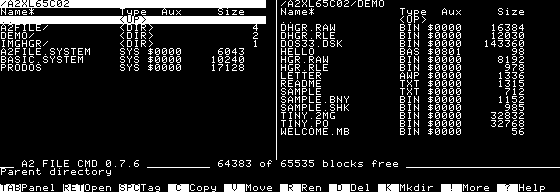

# The A2 File Cmd manual

**Version 0.7.6** — A two-panel ProDOS file manager for an Apple II with
128 KB and 80-column support. Free software by Arnaud Verhille, under GPL v3.



## Start here

Choose **6502** for an original, unenhanced IIe. Choose **65C02** for an
enhanced IIe or //c; this edition also supports an optional AppleMouse II.
The IIgs has not been tested. The launcher checks the CPU and memory before
starting and identifies the edition on its title screen.

### Choose your disks

| Edition | What to use |
|---|---|
| **BOOT + EXTRA** | Two 140 KB floppies for the same CPU and release. Boot BOOT; EXTRA supplies the additional tools and BASIC.SYSTEM. |
| **XL** | One bootable 32 MB `.2mg` with all 44 overlays, BASIC.SYSTEM and demonstration files. No EXTRA disk is needed. |

The download names include the CPU, role and version:

| CPU | Image names |
|---|---|
| 6502 | `A2FILECMD-6502-BOOT-0.7.6.dsk`, `A2FILECMD-6502-EXTRA-0.7.6.dsk`, `A2FILECMD-6502-XL-0.7.6.2mg` |
| 65C02 | `A2FILECMD-65C02-BOOT-0.7.6.dsk`, `A2FILECMD-65C02-EXTRA-0.7.6.dsk`, `A2FILECMD-65C02-XL-0.7.6.2mg` |

BOOT and EXTRA are supplied as `.dsk` in DOS sector order; XL uses `.2mg`.
Use the downloaded files directly: changing an extension does not convert an image.
Each floppy image is 143,360 bytes. Check downloads against
`SHA256SUMS-0.7.6.txt`; if all release files are together, run:

```sh
sha256sum -c SHA256SUMS-0.7.6.txt
```

Boot the image, or launch `A2FILE.SYSTEM` from a ProDOS selector. To install
elsewhere, keep `A2FILE.SYSTEM` beside its complete `A2FILE/` directory.
Do not mix `A2FILE.CODE` and native plugins from different builds.

### Read the panels

The highlighted panel is active; **TAB** switches sides. Each panel shows
names, file types, auxiliary types and sizes. The selected row is highlighted,
a star marks a tagged file, and **L** marks a locked file. The header's star
identifies the sort order. Below the panels are free space, selection details,
messages and the key bar. **?** opens the help screen.

The program remembers panel directories, sorting and the active side in
`A2FILE/A2FILE.CFG` when you quit. On the first XL start, the right panel
opens `DEMO/`; try its text, pictures, music and sample archives.

### The companion floppy and disk swaps

EXTRA contains 25 tools absent from BOOT, plus the common menu and
BASIC.SYSTEM. Use the **same CPU and version** on both disks.

With two Disk II drives, keep BOOT in **slot 6, drive 1** and put EXTRA in
**slot 6, drive 2**. The **!** menu lists tools from both disks.

With one drive, choose the tool normally. If a disk is missing, the prompt
names the required volume, slot, drive and file. Press **1** or **2** to
choose the drive, insert the named disk, then press **Return**. If the input
file was on the removed disk, a second prompt asks for that disk. **Escape**
cancels and returns to the panels. The chosen drive is remembered for the
session; these plugin-loading prompts use slot 6.

| CPU | Volume names shown in swap prompts |
|---|---|
| 6502 | BOOT `/A2FC6502`; EXTRA `/A2EXTRA6502`; XL `/A2XL6502` |
| 65C02 | BOOT `/A2FC65C02`; EXTRA `/A2EXTRA65C02`; XL `/A2XL65C02` |

The menu retains all 43 commands when EXTRA is absent. Tools that need both
source and destination online still require another drive or volume.
**DISKCMP S** and **W → Copy** have their own single-drive exchange modes.

### Protect files in /RAM

**Copy anything important out of `/RAM` before displaying DHGR, loading
music, extracting ShrinkIt, using disk-image operations or physically
formatting a Disk II floppy.** These operations use auxiliary memory and
rebuild `/RAM` empty; the message line reports it. Plain HGR pictures do not
clear `/RAM`. Avoid writing to `/RAM` while music is playing.

## Keys

| Key | Action |
|---|---|
| **Up / Down** | Previous / next entry. |
| **Left / Right**, **< / >**, **- / +** | Previous / next page; **[ / ]** jumps to first / last entry. |
| **TAB / =** | Switch panel / show the same directory in the other panel. |
| **RETURN / ESC / /** | Open / go up / list volumes. Return asks before running a program. |
| **'**, then letter or digit | Jump to the next name with that initial. |
| **SPACE / \*** | Toggle the selection's tag / invert all tags. |
| **Ctrl-T / Ctrl-N / Ctrl-R** | Tag all / untag all / reread both panels. |
| **S / M** | Change sorting / tag files absent or different in size/date in the other panel. |
| **C / V** | Copy / move tagged entries, otherwise the selection, to the other panel. Includes directories. Move deletes originals after copying. |
| **D** | Delete tagged entries or the selection, including directory contents, after confirmation. |
| **R / K** | Rename / create a directory. Names: letter first, then letters, digits or periods; maximum 15 characters. |
| **A / L** | Change hexadecimal type/auxtype / lock or unlock. Locked files refuse deletion and renaming. |
| **T / H / I** | Read text / hexadecimal / picture. T also lists BAS and AWP files. |
| **E** | Edit text; on a directory or `..`, create a text file. |
| **P / X** | Pause/resume music / run a program after confirmation, replacing A2FC. |
| **W / F / !** | Disk-image operations / format / plugin menu. |
| **? / 1 … 0 / Q** | Help / key-bar buttons / quit to ProDOS after confirmation. |

Copying preserves name, type and auxiliary type. For an existing target,
choose **O** overwrite, **S** skip, **A** overwrite all or **N** overwrite
none. Existing destination directories are filled in. Copying into the same
or a nested source directory is refused.

Long operations display progress. **ESC** interrupts; completed work remains,
an incomplete ordinary file copy is removed, and the final message reports
what was done. Read the result before removing a disk.

### The mouse

On 65C02, an AppleMouse II supplements the keyboard. Click a row to select
it; click the selected row again to open it. Click a path to go up, a column
header to change sorting, or a key-bar button to invoke it. Viewers, the
editor and prompts use the keyboard.

## More tools in the ! menu

Select the item first, press **!**, then choose a tool. **Up/Down** moves a
line, **Left/Right** changes page, and a letter jumps to a matching initial.
The following tools supplement the main keys and readers.

### On BOOT and XL

| Tool | Operation |
|---|---|
| **COMPARE** | Compare the selected file byte by byte with the same name in the other panel. |
| **TXTCONV** | C = CR, L = LF, D = CRLF, H = clear high bit, S = set it, T = expand tabs, A = transliterate UTF-8 accents. Write in place or to the other panel. |
| **DATE** | S sets date/time from `DDMMYYYYHHMM` (1940–2039). F stamps modification dates on tagged files or the selection. Creation dates stay unchanged; a hardware clock may replace the entered time. |
| **VERIFY** | Read tagged files (skip directories), the selection, or every block of a volume. Report processed files and errors; ESC cancels. No writes. |
| **TAGPAT** | Name patterns: `=` any string, `?` one character. Add comma-separated filters: `T04` TXT, `>2000` or `<2000` bytes, `D` modified today. T tags, U untags, X replaces tags. |
| **VOLINFO** | Audit allocation and fragmentation. M = bitmap (`.` free, `#` used), F = selected file blocks, E = export to the other panel. N/P pages; ESC returns. No repairs. |
| **VOLNAME** | Rename a ProDOS volume and update the affected panel/program paths. |
| **WIPE** | F zeroes free blocks after confirmation. W zeroes the whole volume after `ERASE`; the running program's volume is refused. |

### On EXTRA and XL

| Tool | Operation |
|---|---|
| **SEARCH** | Find text in the active directory and tag matching files, ignoring case. |
| **FIXTYPES** | Set type/auxtype from suffixes on tagged files or the selection; optionally remove suffixes. Image suffixes and `.SYSTEM` stay. |
| **GOTO** | Nine favourite directories: A adds, D then a digit removes, 1–9 jumps. Saved in `A2FILE/GOTO.CFG`. |
| **FIND** | Search the volume by name pattern; start with `"` to search contents, ignoring case. TAB sets type (T, two hex digits) and modification dates (D, inclusive YYYYMMDD, 1940–2039); A clears filters. Undated files are excluded by date filters. N shows the next 20 results; Return jumps there. V on a text result shows occurrence offsets (hex) and excerpts; N/Space continues, ESC returns. |
| **BLKVIEW** | Read device or image blocks: H hex/ASCII, D directory, I index, N/P block, Space page, G four-digit hex block, F find four bytes (8 hex digits), A find next, X extract blocks, ESC back. Source stays unchanged. |
| **DISASM** | Read BIN/SYS as assembly: N/Space next, P previous (last 64 pages), C 6502/65C02, G six-digit hex file offset, L four-digit load address, R start, E export, ESC back. BIN uses its auxtype; SYS starts at $2000. |
| **CRC** | Calculate CRC-32 for the selection or tagged files. |
| **IDENT** | Identify a file by content; text statistics cover its first 512 bytes. |
| **MDVIEW** | Read Markdown or long text with wrapping, headings, lists and code; page forward/back. |
| **RENAME** | Batch prefix, suffix, extension replacement/removal or numbering. For example E then BAK sets `.BAK`. Conflicts are skipped. |
| **IMGCONV** | Convert PO/HDV, DSK/DO and 2MG into the other panel, preserving disk blocks. |
| **BOOTBLK** | Copy ProDOS boot blocks from the boot volume to another volume after confirmation. |
| **UNDELETE** | Browse deleted ProDOS entries. N skips; R recovers a validated candidate to another online volume. Existing names are refused. |
| **DISKCMP** | V compares online ProDOS volumes; I compares images; S compares two Disk II disks on one drive. Reports differing blocks and the first mismatch. |
| **MKIMAGE** | Create an empty ProDOS PO or 2MG: 140 KB, 800 KB, 2/4/8 MB or 32,767 blocks. New images are data volumes, without a boot program. |
| **RESCUE** | F recovers a file; V recovers a ProDOS volume. Uses up to 30 attempts per block, zero-fills unreadable chunks and writes a LOG. Destination must be another online volume. |
| **SYNC** | Recursively copy missing or newer files to the other panel after confirming direction. Destination-only files remain; copies are read back before replacement. |
| **TREE** | Show file sizes and cumulative directory totals. Space advances a page; ESC exits. |

### Recovery and comparison limits

**UNDELETE never changes the source directory, indexes or bitmap.** It checks
retained pointers, block counts, free blocks and index halves swapped by
ProDOS DESTROY. An interrupted DESTROY can leave a deleted entry with damaged
allocation information: the deleted marker alone is insufficient. Reused,
inconsistent or ambiguous candidates are refused. Standard seedling, sapling
and tree files, including sparse files, are supported; deleted directories
and resource forks are not. Inspect recovered data before relying on it.

**RESCUE** writes `BASE.REC` for a file. Whole-disk recovery writes raw ProDOS
parts `BASE.P01`, `BASE.P02`, etc., up to 16,000 blocks each. Concatenate them
in numeric order for a PO image; a single part can simply receive `.PO`.
`BASE.LOG` records zero-filled chunks and completion or interruption. Partial
output stays after cancellation or a write failure.

**SYNC** skips equal-date or newer destination files. A source with an unknown
date does not replace an existing file. It uses `A2FC.SYNC` temporarily and
`A2FC.BAK` for rollback, preserving pre-existing files with those names.
If replacement fails, the original is restored where possible; keep any
remaining `A2FC.BAK`. Overlapping directory trees are refused. SYNC and TREE
support paths shorter than 64 bytes and up to 16 directory levels; read
errors and unsupported resource forks produce an error/incomplete result.

**DISKCMP S** buffers two blocks per exchange, so a full comparison needs many
swaps. Each prompt names the expected disk and slot/drive; **1/2** changes
the drive, Return retries and Escape cancels. A read error or cancellation
never produces an “identical” verdict. Image comparison supports PO/HDV,
DSK/DO and ProDOS-order 2MG.

**VOLINFO** supports ProDOS files, both forks and directories up to 16 levels.
Large volumes take longer; incomplete counts are unconfirmed. File lists show
data, index, master and extended blocks, omitting sparse holes. Exports include
the selected file and describe the scan before report creation; existing names
are refused. Only complete exports end with `END REPORT`; partial files remain.
**MKIMAGE** refuses
existing names and removes cancelled/incomplete new images; 32,767 blocks
is the maximum that fits in a single ProDOS image file.

**DISASM** shows file offsets, 16-bit CPU addresses, bytes and instructions.
C changes decoding at the current offset and resets page history; 65C02 includes
Rockwell/WDC extensions. Unknown/truncated instructions appear as `.BYTE`.
E exports from the current offset to EOF as a new TXT file in the other panel,
using the displayed CPU and load address. Existing names are refused. ESC cancels;
errors or cancellation keep partial output. Exporting preserves the current page.

**BLKVIEW F** searches forward from the current block, including matches across
block boundaries; A continues without wrapping. X extracts from the current block:
enter a four-digit hex count (maximum `7FFF`) and a new filename in the other panel.
Device sources require another destination volume. Errors retain partial output.

**Disk writes and copies** automatically read back every written block. A readback
error stops at the first failing block. On one drive, each prompt identifies
SOURCE or TARGET copy, the source volume and the slot/drive.

## Reading files and pictures

### Text, hexadecimal and AppleWorks

Use **T** for text, **H** for hexadecimal. **Space**, **Return** or **Down**
advances a page; **B** or **Up** goes back; **ESC** returns to the panels.
The text reader clips lines beyond 80 columns and remembers up to 96 page
starts. Use **MDVIEW** for wrapped text. The hex reader shows addresses,
bytes and their text representation.

T on a BAS file lists Applesoft line numbers and keywords. T or Return on
an AWP document reads AppleWorks word-processor text; formatting commands
are omitted and tabs expanded. AppleWorks databases and spreadsheets are
not supported.

### Pictures

**Return** recognizes pictures by content; **I** explicitly tries the picture
reader. Supported formats are raw HGR (8,192 or 8,184 bytes), raw DHGR
(16,384 bytes, auxiliary plane first), and HGRR/DHRR version 1 RLE files.
**Left/Right** shows the previous/next picture; any other key returns.
Remember that DHGR clears `/RAM`.

### The Mockingboard music

Return on an MB1 `.MB` stream starts playback (maximum 2,304 bytes).
**P** pauses/resumes; another music file replaces it. Playback ends at the
stream's end, on quit or when another program runs. Disk II reads may pause
it briefly. Loading music clears `/RAM`; an absent Mockingboard is reported.

## The text editor

**E** edits a file; on a directory or `..`, it creates one. The editor holds
up to 8 KB, uses CR line endings and strips the high bit on loading. Long
lines do not wrap. A star on the status bar means unsaved changes.

**Arrows** move; **Delete / Ctrl-D** erase left / right. **Ctrl-A / Ctrl-E**
go to line start / end; **Ctrl-P / Ctrl-N** changes page;
**Ctrl-T / Ctrl-B** goes to text start / end. **Return** splits a line;
**Tab** inserts four spaces.

**ESC** opens the menu: **S** save, **X** save and exit, **Q** quit without
saving (confirm if changed), **ESC** continue editing.

Saving preserves the file's ProDOS type and auxiliary type.

## Disk images and formatting

### Disk images

**W** opens three operations: write the selected image to a formatted target
disk, read a disk into a new image in the active directory, or copy one disk
to another. Supported containers are PO, DSK/DO and 2MG.

For a one-drive copy, choose the same drive for source and destination,
then follow the disk prompts. Writing requires **ERASE** in capitals and
refuses the running program's disk. Check the named target before confirming.
Escape cancels before writing. Disk-image operations can clear `/RAM`.

### A disk image as a folder

Return on PO, DSK/DO or 2MG opens a supported ProDOS or DOS 3.3 image
read-only. Navigate with Return and Escape; Escape at its root leaves the
image. **C** extracts tagged files, or the selection, to a real ProDOS
directory in the other panel, preserving type and auxiliary type.

ProDOS image extraction supports files up to 128 KB (seedling/sapling).
Enter subdirectories and extract their files individually; recursive
extraction and writing into an image are not supported.

A real DOS 3.3 disk appears in **/** as `DOS 3.3`, with its slot and drive.
Return opens its catalog; C extracts files to ProDOS. Applesoft, Integer
and binary DOS headers are removed during extraction. DOS 3.3 access is
read-only.

### Formatting a disk

Press **F** or choose **FORMAT** in **!**. Select the drive, enter a volume
name, then type **ERASE** and press Return. The list shows slot, drive,
volume and capacity. The program's own volume is marked **IN USE** and
cannot be formatted. Escape or a different confirmation word cancels.

Disk II formatting clears `/RAM`; move its files elsewhere first. It is
refused if A2FC itself runs from `/RAM`. Formatting another block device
does not require that extra RAM reset. Music stops when FORMAT opens.
The result reports success or an error; Escape returns directly to the panels.

## Archives and programs

### Unpacking archives

Set the destination in the other panel, select the archive, then use **!**:

| Tool | Supported archives |
|---|---|
| **UNSHRINK** | ShrinkIt `.SHK`: stored data, LZW/1 and LZW/2. Files retain ProDOS type and auxiliary type; names are adapted to ProDOS. Disk-image members become PO files. Resource forks and comments are skipped. |
| **BINARY2** | Binary II `.BNY`/`.BQY`: extracts members with their names and attributes. Directory entries are skipped. Compressed members may need a second extraction with UNSHRINK. |

ShrinkIt extraction clears `/RAM` and refuses it as a destination. Keep
archives and recovered files on another volume.

### Running an Applesoft program

**Return** or **X** runs BAS, SYS or BIN after confirmation. The launched
program replaces A2FC; it does not automatically return. A BIN loads at its
auxiliary address, which must be between `$0800` and `$BAFF`.

Applesoft requires `BASIC.SYSTEM`, supplied on EXTRA and XL. A2FC searches
the program's volume, its own volume and the companion. With one floppy
drive, keep the BAS program on another online volume so it remains readable
after BASIC.SYSTEM loads.

From the Applesoft `]` prompt, reinsert BOOT if needed and enter:

```text
-/A2FC6502/A2FILE.SYSTEM
```

Use `/A2FC65C02/` for the enhanced BOOT, `/A2XL6502/` or `/A2XL65C02/` for
XL, or the actual installation path. `-A2FILE.SYSTEM` also works when the
current prefix is its directory. BAS paths over 46 characters use a fallback
launch method; use a shorter path if launch fails.

## VDrive: two volumes over the serial line

A detected Super Serial Card or //c serial port can expose two remote ProDOS
volumes at **115,200 bps**. Slot 2 is tried first. The status line identifies
the serial card and assigned drive slots; the remote volumes then work like
local ones for browsing and copying.

Use a compatible host such as ADTPro's virtual-drive server, `veserver.py`
or `surl-server`. The host supplies date/time during reads. A missing or
disconnected server produces an I/O error. The driver is removed when A2FC
quits or launches another program. VDrive is tested in POM2; operation on a
real Super Serial Card or //c remains unverified.

## Limits and troubleshooting

| Symptom or limit | What to do |
|---|---|
| CPU or memory refusal at startup | Use the matching CPU build, with 128 KB and 80-column support. |
| Missing or stale plugin | Insert matching BOOT/EXTRA from the same release. Keep A2FILE.CODE and its native plugins together. |
| Disk changed but old contents remain | Press Ctrl-R to reread both panels. |
| Run failed: file not found | Check the selected program, its path and BASIC.SYSTEM for BAS files. |
| Image cannot be opened | Check its actual format; renaming PO to DSK does not convert it. Some file/image features are unsupported. |
| Directory exceeds 139 entries | A2FC uses windows in disk order, without sorting. Cross a window edge to continue. |
| Very deep directory copy refused | Simplify the tree or copy smaller subdirectories; recursive operations have bounded working space. |
| Incomplete scan or recovery | Read the reported limits or errors; inspect recovered data and keep originals/backups. |

For building and plugin development, see the project README, `sdk/README.md`
and `bench/README.md`. `make disk` builds both CPU families; `make test`
runs host checks. Planned features and remaining limits are in `TODO.md`.
