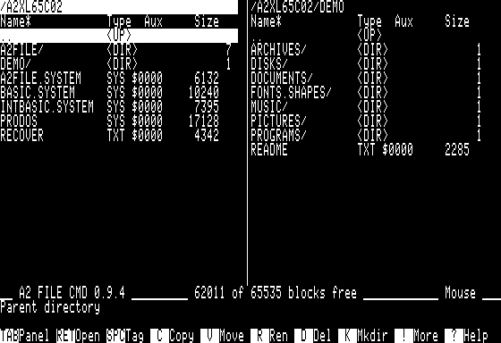
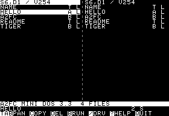

# The A2 File Cmd manual

**Version 0.9.5**. By Arnaud Verhille, GNU GPL v3.



## Contents

- [A2 File Cmd DOS3.3](#a2-file-cmd-dos33)
- [From DOS3.3 to ProDOS](#from-dos33-to-prodos)
- [Keys and panels](#keys-and-panels)
- [Copy, move and edit](#copy-move-and-edit)
- [Recover after an incident](#recover-after-an-incident)
- [Read documents and pictures](#read-documents-and-pictures)
- [Play music](#play-music)
- [Extract archives and run programs](#extract-archives-and-run-programs)
- [Work with disks and images](#work-with-disks-and-images)
- [Find and maintain files](#find-and-maintain-files)
- [Limits, troubleshooting and VDrive](#limits-troubleshooting-and-vdrive)
- [Credits and further reading](#credits-and-further-reading)

## A2 File Cmd DOS3.3



Two panels, a source and a destination: DOS3.3 distils A2 File Cmd into
selecting, reading, editing and verified copying. It uses an **Apple II+ with
48 KB**, NMOS 6502, 40 columns and **two Disk II drives on the boot controller**.
The following chapters extend this workflow with ProDOS folders and tools.

Boot `A2FILECMD-DOS3.3-0.9.5.dsk`, or use **BRUN A2FC** from DOS 3.3. Both panels
start on the boot disk; each remembers drive, selection and scroll. Catalogs
hold up to 105 files and show 19 rows. `?` opens help.

| Keys | Action |
|---|---|
| TAB/Ctrl-I or 1; / or 4 | Switch panels; change active drive. |
| Up/Down or I/K; Left/Right | Previous/next file; previous/next page. [/] first/last. |
| Return or 2; T/H/G; B | Open; force text/hex/hi-res; confirm BRUN. |
| Space; Ctrl-T/N; * | Tag one; all/none; invert tags. |
| C or 3; N/E; D/R/L | Copy; new/edit text; delete/rename/lock. |
| Ctrl-R or 5; = | Reread both panels; same disk opposite. |
| ? or 6; Q or 7; Escape | Help; confirm quit; leave preview/help/editor. |

Questions use **Y** to confirm and **N/Escape** to cancel. Other keys do not
confirm. Escape in the browser has no effect: DOS has no parent directories.
After changing a disk, reread with Ctrl-R. Prompts and the result occupy the
footer; read them before inserting another disk.

### Copy and edit

1. Put the panels on different drives using TAB and `/`.
2. Select/tag the sources and press C. Check `COPY name?` or the marked count.
3. Confirm Y, then wait for the progress bar and final result. **Once started,
   the disk-writing operation cannot be interrupted from the keyboard.**

Copies preserve DOS names, type, lock flag and all data-sector bytes. Existing
names are skipped. Destination sectors are reserved first, written and read
back, then the catalog entry is published. An uncertain write stops the batch;
the source is neither written nor deleted. There is no single-drive copy by
swapping disks.

N/E uses the same exclusive writer. E accepts at most **8 KB** and refuses larger
files rather than truncating them. It always saves to a new name. R refuses an
existing name or locked file. D skips locked files; L toggles the cursor's lock,
or unlocks a tagged set if any member is locked, otherwise locks the set.

### Preview and limits

Return identifies text, hi-res or a binary program from content and DOS headers;
a program asks `BRUN NAME?`. T/H previews only the first 256 stored bytes; G
shows the first 8 KB as hi-res. The hex preview shows eight bytes a row with
their characters, one half of the sector at a time: Left/Right (or -/+, </>)
switch between bytes 00-7F and 80-FF. A valid 8 KB BIN load at $2000/$4000 is a picture;
unsupported or unsafe program headers fall back to hex. BRUN leaves A2FC.

Only standard 35-track, 16-sector DOS 3.3 is supported. Sparse/inconsistent
chains, reserved-track data, 13-sector, 40-track and protected formats are
refused. Before a write, the catalog entry must still match the panel's identity;
a changed disk is refused, though a byte-identical twin cannot be distinguished.
Physical write protection is checked. After an uncertain error, reserved space
is retained and further writes are blocked for that run: preserve and inspect a
copy of the disk. Readback cannot repair metadata damaged by a power failure.

<!-- pagebreak -->

## From DOS3.3 to ProDOS

ProDOS builds on the same two-panel workflow: folders, attributes, archives,
documents, pictures, music and disk tools. It needs an **Apple IIe, //c or IIgs
with 128 KB and 80 columns**. This is a separate program: its commands, plugins
and recovery filenames do not apply to the DOS3.3 edition introduced first.

### Five self-contained images

| Image | Choose it for |
|---|---|
| `A2FILECMD-DOS3.3-0.9.5.dsk` | Standalone DOS 3.3 file manager for Apple II+ and two Disk II drives. |
| `A2FILECMD-PRODOS-140K-0.9.5.dsk` | One 5¼-inch ProDOS disk with essential file operations and text editing; any IIe. |
| `A2FILECMD-PRODOS-800K-0.9.5.po` | All ProDOS tools and BASIC runtimes, without the demonstration corpus; any IIe. |
| `A2FILECMD-PRODOS-XL-0.9.5.2mg` | Complete 32 MB ProDOS edition with tools and demonstrations; any IIe. |
| `A2FILECMD-PRODOS-XL-65C02-enhanced-0.9.5.2mg` | Complete XL for an enhanced IIe, //c or IIgs: MouseText and optional mouse support. |

The choice is **enhanced or not**. The enhanced XL needs an enhanced IIe,
a //c or a IIgs; every other ProDOS image runs on any IIe, enhanced or not.
An enhanced machine always has the 65C02 the enhanced XL is compiled for:
the launcher checks machine, processor and memory before starting, so a
hand-modified machine is refused rather than crashed. Mouse hardware is
optional.

140K and DOS3.3 use DOS-sector-order `.dsk`; 800K uses ProDOS-order `.po`.
XL uses `.2mg`. Renaming an extension does not convert an image. With all
release images and the PDF in the same directory, check their downloads:

```sh
sha256sum -c SHA256SUMS-0.9.5.txt
```

### Install and start

Boot the selected image, or launch `A2FILE.SYSTEM` from a ProDOS selector.
When installing elsewhere, keep `A2FILE.SYSTEM` beside the complete `A2FILE/`
directory and copy `RECOVER` too. Keep the program and its native plugins
from the same build and CPU edition; do not mix them.

The 140K disk provides navigation, tags, copy/move/delete, rename and
attributes, text editing, text/hex readers, comparison, formatting, verification
and ProDOS image extraction. Advanced disk tools, DOS extraction, archives,
media players and BASIC runtimes require **800K or XL**. Their menus list the
available tools without asking for category disks. Both complete editions
include all 84 overlays; only XL includes `DEMO/`: at least one example of every
kind of file A2 File Cmd opens, for every viewer, in DOCUMENTS, PICTURES (with
an HGR album), MOVIES (Fantavision), MUSIC, ARCHIVES, DISKS, PROGRAMS and
FONTS.SHAPES, and a README saying what is where.

### Before working

Use copies of valuable disks. Read each target name before confirming an
operation. Keep space for both old and new versions during replacement.
Do not remove a disk until the operation reports its result.

Some tools use auxiliary memory and rebuild **/RAM empty**. When /RAM holds
files, A2FC asks before that use and explicitly warns that **ALL /RAM files
will be lost**; an empty /RAM has nothing to lose and is used without a
question. Copy the files elsewhere first; declining preserves them. This
applies to affected picture viewers, the PT3 player (GROUiK's engine; a
declined question plays with pt3_lib instead), large VisiCalc worksheets,
ShrinkIt, disk-image operations, Disk II formatting, NIBCOPY and full
large-volume checks. Ordinary text readers and the other music players
preserve /RAM.

<!-- pagebreak -->

## Keys and panels

**TAB** changes the active panel. The highlighted row is the cursor; `*` marks
a tagged entry and `L` a locked one. Directories end in `/`. The header's star
shows the sort order. Messages and progress appear below the panels.

| Keys | Action |
|---|---|
| Up/Down; Left/Right or < / > | Move one entry; move one page. [ / ] goes to first/last. |
| Return / Escape / / | Open; parent directory; list volumes. Return asks before running a program. |
| TAB / = / Ctrl-R | Other panel; same directory opposite; reread both panels. |
| Space / * / Ctrl-T / Ctrl-N | Tag one; invert tags; tag all; clear tags. |
| S / M / ' then initial | Change sort; tag size/date differences; jump to a name. |
| C / V / D | Copy; move; delete. Use tags, or the cursor when none are tagged. |
| R / K / A / L | Rename; new directory; type/auxtype; lock/unlock. |
| T / H / I / E / X | Text; hex; picture; edit; run after confirmation. |
| W / F / ! / ? / Q | Disk images; format; tools menu; help; quit after confirmation. |
| 1 … 0 | Activate the corresponding bottom key-bar button. |

Names start with a letter, then letters, digits or periods, up to 15 characters.
Directories can be tagged; `..` cannot. Returning to a parent selects the child
you left if it still exists. Large directories use unsorted windows in disk
order; continue through the window edge to reach later entries.

Enhanced mouse support lets you select a row, click it again to open, click
a path to go up, a header to sort or a key-bar button to act. Prompts, viewers
and the editor use the keyboard. On quit, A2FC saves panel paths, sorting and
active side; a failed preference save lets you cancel quitting.

## Copy, move and edit

1. Open the destination in the other panel. In the source, clear unwanted
   tags with **Ctrl-N**, then select or tag the entries to transfer.
2. Press **C** or **V**. For an existing target: **O** overwrites, **S** skips,
   **A** overwrites all and **N** overwrites none. Check the destination first.
3. Wait for **Copying** and **Verifying**, then read the result. Move removes
   a source only after its copy is verified. Existing directories are filled
   in; copying into the source or its descendants is refused.

Copy preserves type and auxtype. Replacements retain the old target during
verification. **Escape** interrupts; completed work remains. If cleanup fails,
a temporary can remain: use the recovery procedure before retrying. Deep trees
may be refused; process smaller subdirectories rather than bypassing the limit.

**! → Files → MOVE** can relocate a single entry within a volume without
copying its data blocks. A marked batch first reserves `A2MOVE.LST`, refuses
marked directories and stops on error or Escape. Cross-volume copies are
verified before source deletion. Keep any retained work list for review.

**E** edits up to **5,104 bytes**, with CR line endings; loading strips the
high bit and long lines do not wrap. On a directory or `..`, E creates text.
Arrows move; Delete/Ctrl-D erase left/right; Ctrl-A/E goes to line start/end;
Ctrl-P/N changes page; Ctrl-T/B goes to text start/end. Return splits a line;
Tab inserts four spaces. Escape opens **S** save, **X** save/exit, **Q** abandon
(confirm changes), or Escape to continue. Saving preserves type/auxtype and
uses verified `A2FC.EDIT` plus `A2FC.ED.BAK`; existing recovery files block saving.

<!-- pagebreak -->

## Recover after an incident

Every ProDOS disk includes **RECOVER** at its root. Open it with Return; the
`?` help screen points to it. Recovery begins by preserving evidence, not by
retrying the failed operation or deleting the files it left behind.

### Preserve, identify, recover

1. Stop and record the exact error, source path and intended destination.
   Make a disk image or duplicate before changing anything. Work on the
   duplicate and recover onto a separate healthy disk. If reads are unreliable
   and no independent copy is possible, stop and seek help.
2. Keep the target, temporary and backup. A name, date or matching size does
   not prove completeness. A generic `A2FC.BAK` may belong to an earlier
   operation: if its original target is unknown, preserve it without guessing.
3. On the **duplicate only**, rename one identified candidate to an unused
   `RECOV.OLD` or `RECOV.NEW`. This is necessary for `A2FC.COPY`, which C cannot
   copy under that reserved name. Choose another name if it is already taken.
4. Put a fresh recovery directory in the other panel, clear source tags with
   **Ctrl-N**, select the candidate and press **C**. Refuse overwrite. Wait
   for copying **and verification**; an error means recovery is not confirmed.
5. Check the recovered content with its reader, or compare all bytes against
   a known good source. Do not execute an unknown program to test it. Only
   after validation, give the recovered copy its intended name in an empty
   directory. Keep the disk image and other candidates until satisfied.

### Recognize the files

| Operation | New candidate | Previous version |
|---|---|---|
| Copy | `A2FC.COPY` | `A2FC.BAK` |
| Editor | `A2FC.EDIT` | `A2FC.ED.BAK` |
| SYNC | `A2FC.SYNC` | `A2FC.BAK` |
| Text / image conversion | `TXTCONV.TMP` / `IMGCONV.TMP` | `A2FC.BAK` |
| DOS image write | `A2FC.DOS` | `A2FC.BAK` |
| Preferences in A2FILE/ | `A2FILE.TMP` | `A2FILE.BAK` |
| GOTO in A2FILE/ | `GOTO.TMP` | `GOTO.BAK` |

**Target plus backup** can mean installation succeeded but cleanup failed.
**Backup without target** can mean restoration is needed. A **temporary** can
be incomplete or verified but not installed. Preserve the candidates until
checked; absence of a backup does not prove an interrupted write completed.
A reported successful save with a retained backup is distinct from a failed
save. Read the exact message and validate the saved target before cleanup.

For a partial move, compare both sides file by file. **A2MOVE.LST is a work
list, not file contents**: do not replay, edit or delete it as a recovery
shortcut. Copy missing files into a fresh directory and retain remaining
sources. Extraction may leave partial output under its normal filename.

Keep power on for files in **/RAM**; do not reboot or accept AUX reclamation.
A2FC does not infer original names, automatically resume interrupted work or
promise survival of a power cut during physical metadata writes. More failure
cases are documented in [Data safety](DATA-SAFETY.md).

<!-- pagebreak -->

## Read documents and pictures

### Text and documents

**T** reads text; **H** shows offsets, bytes and characters. Space/Return/Down
advances; B/Up goes back; Escape returns. TEXT clips lines at 80 columns and
remembers 96 page starts; **R** restarts it. Use **MDVIEW** for wrapped text
and Markdown, with 64 previous pages and no forward limit. It also reads
extracted Magic Window `.MW` documents. Teach extended files are unsupported.
Return on an Epistole document (text opening on a `_` command) or a Papyrus or
HomeWord one (opening on a $FF code; the others through **!**) opens
**DOCVIEW**, laid out as printed: margins, indents, centring, bold in inverse,
mail-merge variables. French ISO 646-FR accents show unaccented; **A** shows
them as stored, for a French character set. Epistole's calculations are
computed as Epistole prints them, on the Applesoft ROM's arithmetic: `#:X=…]`
sets a variable, `#:?…]` shows a value with `_ND` decimals (2 by default), a
decimal comma, its comma on the `_TD` tab, and no minus sign when there are
decimals, as Epistole prints it. What cannot be computed (a division by zero,
a variable typed at print time, `#*X=]`) stays as written, in inverse.
Headers (`_EN`) and footers (`_DB`, `%$` the page number) appear at each `_SP`
page break and the footer again at the end; DOCVIEW does not repeat them at
the printer's own page ends. It reads documents up to 64 KB and remembers 16
pages back. Bank Street Writer documents (a BIN at $0840 or $63D0 from DOS 3.3,
at 0 from ProDOS, high-bit text) open in DOCVIEW too, with Return: paragraphs
wrapped, centred lines centred, tabs of four columns; the text ends at its
first $00, the rest of the file being the program's leftovers. Extract them
from a DOS 3.3 disk with **C** first.
HEX uses **G** for a seven-digit offset and **R/E** for first/last page.

Logo procedures open as text with Return: Apple Logo's (DOS 3.3 text files) as
any text, Terrapin Logo's (`NAME.LOGO`, a BIN at $2000) by their suffix.
T lists Applesoft, Integer BASIC and Business BASIC (`.BA3`) without running
them. T/Return reads AppleWorks word-processing text, omitting layout commands.
Return on an AppleWorks database or spreadsheet opens **AWDATA**: Space/Down
and B/Up page, Left/Right moves columns, R restarts, and F switches between a
sheet and cell details. Database TAB shows categories 23–30. Limits are 2,688
records or 882 spreadsheet rows; displayed formulas/results are the saved ones,
not a recalculation. Formats, reports and window settings are omitted.

Return on a VisiCalc worksheet (a `/SS` file: text whose first line is a
cell such as `>B3:`; extract it from a DOS 3.3 disk with **C** first) opens
**VISICALC**, which recalculates the sheet and shows it as VisiCalc does on
loading it. A worksheet holds only what was typed, so the overlay computes
every formula once, in the sheet's order (by columns or rows), with
VisiCalc's own decimal arithmetic: twelve digits, truncated, operators from
left to right (`2+3*4` is 20); a formula that refers to one not yet computed
shows ERROR, as in VisiCalc until **!** was pressed. Cells appear in their
columns with VisiCalc's formats (`/F$`, `/FI`, `/FL`, `/FR`, `/F*`, its
general format and `>>>` overflow), the cursor cell in inverse, its name and
contents on the first row. The arrows move the cursor, Space/Return and B go
a screen down and up, `>` and `<` a screen of columns, R back to A1, Escape
returns. Powers and `@SQRT`, `@LN`, `@SIN`... are computed by the Applesoft
ROM, whose last digits may differ from VisiCalc's own. A sheet of up to about
240 numbers and formulas fits in main memory; a larger one uses the auxiliary
memory, which rebuilds /RAM afterwards and says so; A2 File Cmd asks first
when /RAM holds files (No: the sheet is refused, /RAM untouched). Read only;
VISICALC.BIN, beside the overlay, holds its other parts. Text that starts
with `>` but is no worksheet is refused: **T** shows it as text. The format
is described in [VisiCalc worksheets](VISICALC-FORMAT.md).

### Pictures: Return or I

Return and I select the same recognized picture formats on both CPU editions.
Explicit packed types take priority; signatures identify DGR and HGRR/DHRR.
An identification read/close error stops opening. **H** explicitly selects hex.
Specialized viewers and media tools require **800K or XL**.

| Picture or font | Identification / tool |
|---|---|
| Raw HGR / DHGR, HGRR / DHRR | IMAGE; raw pages or version 1 RLE. Dazzle Draw pictures are raw DHGR. |
| Movie Maker | IMAGE; `.BKG` backgrounds are raw pages, `.SHP` shape sheets (BIN $1DF0, 8,720 bytes) a page after a 528-byte header. |
| KoalaPad (Micro-Illustrator) | IMAGE; `PICTR.*` are raw pages, BIN aux $4000, 8,184 bytes once copied from the DOS 3.3 data disk with **C**. C64/Atari Koala files are not Apple pictures: hex. |
| Lo-res / DGR, text screens | DGRVIEW; DGR signature or BIN/FOT with aux $0400 (a saved screen page: lo-res picture or text, told apart by content). I can ask for a raw sprite width. |
| Extasie / Arlequin | EXTASIE ($F2); ARLEQUIN ($F8 with its signature). |
| MacPaint | MACPAINT; `.MAC`, optionally with a MacBinary header. |
| Packed FOT / LZ4FH | PACKFOT ($08/$4000 or $4001); LZ4FH ($08/$8066). |
| Packed 816/Paint | PAINT816; BIN with aux $E001 or $E002. |
| Purplesoft | PURPLE; matching `.FOTO1` and `.FOTO2` in one directory. |
| Print Shop | PRINTSHOP; 572/576-byte BIN clip art, aux $4800/$5800/$6800/$7800. |
| The Newsroom | NEWSROOM; photos `PH.*` and banners `BN.*`, BIN aux $4000 (copied from DOS 3.3). |
| Graphics Magician (Penguin, 1982-1984) | GMAGIC; a BIN whose first bytes are picture commands (no header, no name convention), Return only. |
| MGTK or hi-res fonts | FONTVIEW; type $07, a BIN of 768 or 1,024 bytes named `.SET` (DOS Tool Kit HRCG sets) or `.FONT` (Beagle's), or select the tool for an untyped font. |
| Applesoft shapes | SHAPES; `.SHAPE` or choose the tool directly. |

Raw HGR accepts any size from **8,184 to 8,199 bytes** (a page eight bytes short,
KoalaPad's re-saved 8,191, Terrapin Logo's 8,194); DHGR accepts **16,376 to
16,391**, auxiliary
plane first: the one-file layout Dazzle Draw saves (BIN, aux $2000, 16,384
bytes), so its pictures and slide-show disks open as they are. Left/Right browses the previous/next file handled by the same
viewer, including across directory windows. Right on the last one goes round
to the first; Left on the first does nothing.
**S** starts a slideshow in every picture viewer: the next picture comes by
itself after about ten seconds (at 1 MHz; faster on an accelerated machine),
round the folder without end. **S** again, or any other key, stops it; that
key then acts as usual (Escape returns, an arrow moves). A picture alone in
its folder is shown again. A picture that cannot be read ends the slideshow
with its message.
**Text screens.** A saved page of the screen (BIN at $0400, typically
1,016 to 1,024 bytes; 976 when the last row was not saved; more than 1,024
is read as 80 columns, auxiliary half first) is either a lo-res picture or a
text screen: a title, crack or menu screen. DGRVIEW counts its visible bytes:
a text screen has at least a quarter of spaces ($A0, inverse $20, $E0) and
more spaces than "solid" bytes (two equal nibbles, the flat areas of a
picture). On 77 real text screens and 45 real lo-res pictures from Asimov
and French Touch, none was misread. The screen is shown by the Apple's own
text mode: 40 columns in the primary set (flashing characters flash), 80
in the alternate set (MouseText). **T** reads the same bytes the other way
(text or lo-res), **A** switches the character set; neither writes the
screen again. Only the 960 visible bytes of each half are written: the
screen holes keep the cards' state, and 80 columns write AUX $0400-$07FF,
the 80-column text page, which /RAM never uses. Two separate 1,023-byte
halves of an 80-column screen (as some disks keep them) are shown one at a
time in 40 columns. While Left/Right looks for the next picture, the
activity cell may appear for a moment at the bottom right of a text screen.

Loading shows the filename; Escape returns to the panels. Ordinary small BIN
files open in hex with Return; I can treat a suitable one as a sprite.

Viewers that need AUX ask **before** writing it when /RAM holds files, and rebuild /RAM empty afterwards; an empty /RAM is used without a question.
Consent lasts only for that browsing session; leaving and reopening asks again.
**NRCLIP** (`!` menu, Images) turns a commercial Newsroom clip-art disk (the
program's own and Clip Art Collections 1-3, which hold no files) into
pictures. Open the disk in the active panel (a `.DSK`/`.DO`, a DOS-order
`.2MG`, or the real floppy) and a ProDOS directory in the other one: each
page is drawn on the hi-res screen, then saved there as a BIN $2000 of 8,192
bytes (a raw HGR page) named after the page, the way DOS 3.3 names are
copied (`MEN 1` gives `MEN.1`). A name already there is skipped, never
overwritten; a damaged page is skipped; a failed write removes its file and
stops; Escape stops between pages. The message line counts the pages saved,
already there and damaged. The clip-art disk is only read, and /RAM is kept.

**GMAGIC** draws The Graphics Magician's pictures (Penguin Software, 1982-1984,
used by the adventure games of Penguin/Polarware: Transylvania, The Quest, Ring
Quest...) the way the original routines do, on the visible hi-res page: lines,
flood fills with the 108 patterns, brush stamps and, in the 1984 version, text.
A picture is a list of drawing commands with no header: Return opens a BIN
whose first bytes are such commands, and GMAGIC checks every picture of the
file before drawing (a damaged one is refused). The 1982 and 1984 versions
fill differently: a file is drawn as **V82** unless it uses commands only the
1984 version has; **D** redraws it in the other version. A file may hold
several pictures: **N** (or Space) shows the next one on a cleared page and
comes back to the first after the last; **O** draws the next one over the
picture shown (the rooms of The Quest and Ring Quest keep an open door or an
object as such an overlay). Text is drawn with A2 File Cmd's own font
(BOLD.SET), not Penguin's: only a few pictures of the tool's own disks have
text, and they differ there. The Quest DR's pictures are 1984 ones that use
no 1984-only command: press **D** for them. Recognition reads only the first
bytes, so a program that happens to start like a picture is refused by
GMAGIC: **H** shows any file in hex. Read only, /RAM kept; the format is
described in [Graphics Magician pictures](GRAPHICS-MAGICIAN-FORMAT.md).

Malformed pictures are refused. LZ4FH, PRINTSHOP, NEWSROOM, NRCLIP, GMAGIC, FONTVIEW and SHAPES preserve
/RAM. Keep both Purplesoft companion files; extended EVE modes require compatible
hardware. MACPAINT shows 560 × 192 of its 576 × 720 image; Up/Down pans by 96
lines. SHAPES shows 24 shapes a page, Space/Down next and B/Up previous.

Return on a Fantavision movie (`M.*`, BIN $8400) plays it in **FANTA.SYSTEM**
(800K and XL), which replaces A2FC while it plays and brings it back after.
It plays at the **original speed** (each frame held as long as Fantavision
itself takes to draw it on a 1 MHz Apple II). **Tab** switches to the
accelerated speed and back, **Space** pauses, **1**-**9** slow the
accelerated speed down, **0** removes the delay, **Escape** returns. A movie
always starts again: a counted one stays two seconds on its last frame, then
plays from the start. **S** starts or stops the slideshow: each movie plays
once round, stays two seconds, and the next movie of its folder follows (in
directory order, the first after the last), until Escape. A movie refused
during a slideshow shows its reason three seconds, then the next one plays;
a key returns. A damaged tail is cut; a movie with no whole frame is
refused with its reason. Ctrl-Reset returns to A2FC. Main memory only: /RAM is
untouched. Backdrop:
mark (Space) one hi-res picture in the movie's folder before Return;
otherwise `NAME` beside `M.NAME`, or else a picture whose name begins with
`NAME` (`CHECKERBOARD` for `M.CHECKER`; `NAME` of
4 characters or more), is used. The speed and the slideshow are not kept
once back in A2FC.

Return on a Take 1 movie (`MV.*`, Baudville 1985) plays it in
**TAKE1.SYSTEM** (800K and XL), which replaces A2FC while it plays and brings
it back after. Take 1 movies live on DOS 3.3 disks: open the disk image
(`.DSK`, `.DO`, DOS-order `.2MG`) or the real disk from **/**, then Return on
the movie; its scenes, actors, backgrounds and fonts are read from the same
disk, by name. A movie extracted with **C** into a ProDOS folder plays too, its
files beside it under the names extraction gives them -- but ProDOS names
keep 15 characters, and on some real disks several files shrink to one name
(`BK.UNDERGROUND-1` to `-4`, `SN.HOPPY.WALK.ON1` to `ON3`...): only one can
be extracted, and the movie then plays the wrong scene or is refused. Playing
from the disk or its image is the faithful way. Ctrl-Reset during a movie
returns to A2FC. It plays at the
**original speed**, with its fades and speaker sounds; **Tab** switches to the
accelerated speed and back, **Space** pauses, **Return** or a paddle button
answers a scene that waits, **Escape** returns. The movie stays two seconds on
its last frame and starts again. A missing or damaged file is refused with its
name. Read-only, main memory only: /RAM is untouched. The command is limited
to 46 characters: an image path of 41 characters at most.

<!-- pagebreak -->

## Play music

Music players are included on **800K and XL** and run in the foreground.
**P** pauses/resumes, **Escape** stops, and Left/Right selects the
previous/next tune of the same type in the directory. A new track starts
unpaused. A missing card or invalid data produces an error instead of playback.

**MUSIC:** MB1 `.MB`, up to 4,096 bytes, six Mockingboard voices.
**PT3:** up to 65,535 bytes, three voices or standard two-module `02TS`
TurboSound with six. **DUET:** up to 7,168 bytes, type $D5/$D0E7, `.ED`,
or compatible BIN names beginning `M.`.

PT3 has two players. A single module of 32 KB or less plays with **GROUiK /
French Touch's player** (a 6502 translation of S.V. Bulba's ZX Spectrum
player, `A2FILE/PPT3.BIN`), which keeps the whole module in **auxiliary
memory**, where ProDOS keeps the /RAM disk. When /RAM holds files, A2FC first
asks "ALL /RAM files will be LOST. Continue?" (once while leafing through a
folder); an empty /RAM loses nothing and is not asked about. After playback
/RAM is rebuilt empty and the message line says "/RAM rebuilt.". With this
player the module is read twice, then **the source file is closed before the
first note**: the disk may be removed while it plays. Answering **N**, a
TurboSound pair, a larger module or a missing `PPT3.BIN` plays with **Vince
Weaver's pt3_lib** instead, in main memory only: /RAM is preserved, and the
source disk stays open, so leave it mounted. The fourth line of the player
screen names the player in use. Both are tuned for the Mockingboard: every
period written for the ZX Spectrum's 1.7734 MHz AY is converted to the
Apple II's 1.0227 MHz clock, so tunes play at their written pitch (to the
rounding of the period). The two players follow their own lineage of
Bulba's code and can still differ on some modules: see
`src/plugins/ppt3/README.md`.

Mockingboard is detected automatically. A Mockingboard 4c on //c can hide its
mouse firmware: A2FC then keeps keyboard navigation and disables mouse calls
until that firmware is restored by reset. A plain //c without the card is
unaffected. MUSIC and DUET preserve /RAM. Slow reads and large dual modules
can delay pt3_lib's playback; 50 Hz is not guaranteed for every tune.
Unsupported effects, invalid pointers, runaway command streams and I/O errors
stop either player with a message: neither reads outside the module.

DUET uses the speaker when no Mockingboard is present. **1/2** switches
speaker/card; **D** cycles speaker pulse width. Keys take effect at the next
record on the speaker. Files are validated before playback; FIXTYPES can
review old extracted DUET files without changing their content.

## Extract archives and run programs

### Extract into the other panel

Open the destination first, select the archive and choose its tool in **!**.
Return also recognizes common archive suffixes. Existing names are not replaced.

**UNSHRINK:** `.SHK`, stored/LZW1/LZW2 data and disk images; unsupported
members and resource forks are skipped and reported. **BINARY2:** `.BNY/.BQY`,
whose compressed members may need another extraction. **SCIIBIN:** `.BSC/.BSQ`
with ordered parts and CRC checks. **UNSQ:** `.QQ/.ACU`, directories skipped
and paths flattened. **UNWRAP:** AppleSingle/MacBinary data forks, with omitted
resource forks reported.

ShrinkIt requires permission to clear /RAM and refuses it as the destination.
Escape cancels between blocks. Outputs are read back; errors stop the operation.
Cleanup removes only the current new output, where possible; earlier completed
files remain. A retained partial file is reported and blocks retry under that
name. Preserve it until inspected. Do not assume unsupported or skipped members
were recovered; ACU lengths are checked because its stored CRCs are unreliable.

### Run a program

Return runs BAS, INT or SYS after confirmation; **X** also runs BIN. The program
replaces A2FC and does not automatically return. T lists BASIC without running.
800K/XL include `BASIC.SYSTEM` and `INTBASIC.SYSTEM`; keep the selected program
online while its runtime loads. BIN must load from $0800 and end below $BB00.
A failed preference save asks whether to run anyway. The confirmation shows
A2FC's full return command: from BASIC's `]` prompt, reinsert its disk and use
that command, or `BYE` to the ProDOS selector. Shorten BAS paths over 46 characters
if launch fails. Integer BASIC's runtime supports only a subset of DOS commands.
Ctrl-Reset in a program A2FC started goes to the monitor's `*` prompt (memory
and /RAM kept), unless the program sets its own reset: BASIC.SYSTEM returns to
`]`, FANTA.SYSTEM and TAKE1.SYSTEM return to A2FC.

<!-- pagebreak -->

## Work with disks and images

### Browse and extract

Return opens supported ProDOS or DOS 3.3 images as folders: PO, DSK/DO, 2MG
and supported DiskCopy 4.2 containers. HFS is not supported. Escape at the root
leaves the image. **C** extracts the selection or tags to the other panel.
ProDOS extraction supports seedling/sapling files up to 128 KB; enter each
subdirectory separately. Existing targets are refused; incomplete outputs are
removed where possible and failed cleanup is reported.

A physical DOS 3.3 disk appears in **/** with slot/drive. C extracts to ProDOS
on 800K/XL. BIN/BAS/INT headers and sector padding are removed according to the
header's exact length; BIN retains its load address, BAS uses $0801. TXT keeps
sector data. Leave through **/** before opening a changed disk again.

### Add or replace files

**IMGPUT:** open a ProDOS image opposite a selected source and press C, or
choose **! → Disks → IMGPUT**. It copies only the cursor file, ignoring tags;
V refuses. The image needs a free directory slot and enough free blocks.
Files above 128 KB and directory growth are unsupported. Data is verified
before allocation metadata is installed; interrupted writes can reserve space.

**DOSWRITE:** with a real DOS disk opposite, C confirms source name, slot and
drive. TXT/BIN/BAS/INT up to 65,535 bytes are supported, one cursor file; existing
names are refused. The source must be on another device. **DOSREPL** replaces
an existing DOS file using free sectors, verifies it, then switches its catalog
entry; allow room for both copies. **DOS33W** deletes or renames after confirming
the named file and drive. Locked files and inconsistent allocation are refused.

These tools require 800K/XL and standard 35-track, 16-sector DOS disks on a
Disk II in slots 1–7. They check physical protection and allocation before
writing. A failed write can leave reserved sectors; preserve the disk before
further work. Physical VTOC/catalog writes are not atomic.

For a **DOS image**, C supports DSK/DO and DOS-order 2MG. The tool copies the
whole image to `A2FC.DOS`, validates and modifies that copy, then installs it
with `A2FC.BAK` protecting the old image. Allow space for a second full image.
Protected containers and existing recovery names are refused. Keep reported
recovery files; the source file is never deleted.

### Whole disks, formatting and physical copies

**W** writes an image to a formatted disk, reads a disk into a new image, or
copies disks. PO, DSK/DO and 2MG are supported. Choose the same source/target
drive for exchanges. Each prompt identifies SOURCE or TARGET and slot/drive.
Writes require **ERASE**, refuse the program disk and verify each block.
**F** formats the named drive after ERASE; Escape cancels beforehand. Disk II
formatting clears /RAM, asking first when it holds files, and refuses to run from /RAM.

**NIBCOPY** copies standard Disk II tracks with one or two drives at normal
1 MHz speed. Write-protect the source first. Accept AUX use only after saving
/RAM, then confirm destruction of **all target files, including locked files**.
Single-drive mode requires target confirmation after every exchange. Each source
track is read twice and the written track verified; Escape stops between tracks.
An incomplete target is not a valid backup. Nonstandard/protected, 13-sector,
half-track and weak-bit formats are unsupported; this is not a flux copier.

**PASCAL** and **CPM** extract supported images into the other panel without
modifying the source. Names are adapted to ProDOS; existing targets are skipped.
Pascal text retains its header/padding. CP/M data is rounded to 128-byte records;
text ends at $1A. Unsupported directory layouts are refused. Use **IMGCONV**
for container conversion, not extension changes. No physical-write operation
promises rollback through a power failure.

<!-- pagebreak -->

## Find and maintain files

Press **!**, choose a category, then a tool. Return opens; Escape goes back.
Up/Down moves one entry, Left/Right six, and an initial jumps by name.
Categories describe tasks; no category disk swap is needed. Except COMPARE,
VERIFY and MOVE, the tools below require **800K or XL**. Read each result,
especially partial scans, skipped files and failed cleanup.

### Files and navigation

- **COMPARE / CRC / VERIFY:** compare opposite namesakes byte for byte;
  calculate CRC-32; read files or volume blocks and report errors.
- **TAGPAT / SEARCH / FIND:** tag by pattern; search current-directory text;
  search a volume by name or contents (`"` prefix). FIND: TAB filters, N pages,
  Return jumps and V shows text matches.
- **GOTO:** P opens a path; A adds a favourite, D + digit removes, M + two
  digits reorders, 1–9 jumps.
- **RENAME / DATE / TXTCONV:** batch names; modification dates; CR/LF/CRLF,
  high-bit, tabs or UTF-8 accent conversion. Conflicting names are preserved.
- **IDENT / FIXTYPES:** identify formats; confirm attribute changes individually.
  Hints do not prove a damaged file is valid.
- **SYNC / TREE:** copy missing/newer files recursively; show directory sizes.

TAGPAT uses `=` for any string and `?` for one character; comma filters include
`T04`, `>2000`, `<2000` and `D` (today). T adds tags, U removes, X replaces.
GOTO paths are at most 63 characters. DATE accepts `DDMMYYYYHHMM`, 1940–2039;
creation dates remain unchanged. SYNC preserves destination-only and newer
files, refuses overlapping trees and stops if replacement/recovery fails. An
unknown source date does not authorize replacement. Keep `A2FC.SYNC/A2FC.BAK`.

### Volumes and recovery

**VOLINFO** audits space, allocation and fragmentation: M bitmap, F file blocks,
E export, N/P pages. Partial counts are unconfirmed; only a complete export ends
with `END REPORT`. **VOLNAME** renames a volume and updates affected paths;
a name already online is refused. **MKIMAGE** creates an empty PO/2MG data
volume, without a boot program, up to 32,767 blocks.

**FIXIT only reads.** It reports ProDOS directory/allocation faults and refuses
incomplete scans rather than declaring lost blocks. For volumes above 4,096
blocks, Q checks directories only; F performs a full scan requiring AUX consent.
A quick clean verdict is not a full allocation check. It does not check DOS disks.

**REPAIR** shows a plan and requires **F**, then **FIX**, before writing. It
refuses the program volume, cross-links and uncertain scans; some damaged files
also prevent freeing unclaimed blocks. Writes are read back, restoration is
attempted on error, and the volume is rescanned. Backups are only in RAM:
interruption can leave a partially applied plan. Large scans can take minutes.

**UNDELETE** recovers validated deleted files to another volume without changing
the source. Reused/ambiguous allocation, deleted directories and resource forks
are refused. **RESCUE** retries reads and zero-fills unreadable chunks, recording
losses in `BASE.LOG`. File output is `BASE.REC`; volume parts `BASE.P01`, `.P02`,
etc. must be concatenated in order. Partial output remains. Inspect the log and
recovered contents: neither tool guarantees recovery of missing data.

**WIPE F** checks allocation before zeroing free blocks; **W** destroys an entire
volume after ERASE, excluding the running program's volume. **BOOTBLK** copies
boot blocks after confirmation, with readback and RAM-only originals for attempted
restoration. **BLKVIEW** reads blocks and can extract a range; **DISASM** reads
6502/65C02 instructions and exports text. Their exports can remain partial after
an error. None of these tools should be tried first on an irreplaceable disk.

<!-- pagebreak -->

## Limits, troubleshooting and VDrive

### Read the status before acting

Long copies distinguish **Copying** from **Verifying**; the verification counter
starts again at zero. Every long tool shows a bar or, where none fits, turns
a `/` `\` mark at the end of the line above the messages (DOS3.3: the last
cell of the key bar, which also turns inside DOS's own long calls: the
format, and the retries on a diskette that was never formatted). A drive
change or a head recalibration can still hold it for a second or so. Do
not remove media just
because a counter has stopped; record the screen and wait for a result or a
safe cancellation point.

Escape cancels where the active tool permits it. Completed work remains and
partial output may require recovery. A result that reports skipped, unsupported,
unreadable or retained files is not a fully successful batch. Check the actual
message before retrying or cleaning up.

| Symptom | Action |
|---|---|
| Startup refusal | Choose the matching CPU/ROM edition; ProDOS needs 128 KB and 80 columns. |
| Missing/stale tool | Use 800K/XL and matching program/plugins. |
| Old catalog or a large directory | Ctrl-R rereads; cross window edges beyond 139 entries. Large windows use disk order. |
| Deep traversal refused | Work on smaller subdirectories; an incomplete tree must not be deleted. |
| Temporary/backup blocks retry | Preserve candidates and follow incident recovery. |
| Run or image opening fails | Check paths, runtime, type and actual container; renaming extensions does not convert. |

### Boundaries to keep in mind

A matching size/date does not prove a recovered file complete: COMPARE checks
bytes, M only compares size/date. Unsupported forks or storage may be refused
or skipped with a report. AUX consent clears /RAM without backing it up.
Verification cannot make physical metadata writes atomic across a power cut.

### VDrive: remote volumes

A detected Super Serial Card or //c serial port can expose two remote ProDOS
volumes at **115,200 bps**. VDrive tries slot 2 (the //c's modem port) first,
then slots 3 to 7, and **never slot 1**: that is the printer's (a //e's
printer SSC, the //c's printer port), and VDrive would reprogram it and send
it its packets. It does not even read that card. A VDrive cable on a slot-1
card is therefore not served: put the card in slot 2. In slots 2 to 7, a
Super Serial Card whose mode switches (SW1-5 and SW1-6) are not set to
communications mode -- printer mode, or a SIC emulation -- is a printer's:
VDrive reads those switches first and skips the card without writing to it.
Set the card that talks to the VDrive host to communications mode. A //c has
no switches, so nothing tells a printer on its modem port from a modem:
port 2 is always taken when present, and a printer plugged there receives
VDrive's packets. Keep printers off the //c's modem port while A2FC runs.
Use ADTPro's virtual-drive
server, `veserver.py` or `surl-server`. The status line identifies the serial
interface and assigned drives; browse and copy as with local volumes. The host
supplies date/time during reads. A disconnected server produces an I/O error;
it is not an empty or absent file. The driver is removed on quit or program launch.

For reproducible failures, note the A2FC version/edition, machine, disk type,
full paths, exact message and actions. Keep a disk image before any repair.
The project's issue tracker and detailed data-safety notes are linked in the
last chapter. Automated emulator tests do not replace trials on physical drives.

<!-- pagebreak -->

## Credits and further reading

A2 File Cmd is **GNU GPL v3** software by **Arnaud Verhille**. Its two-panel
interface draws inspiration from A2Command and Norton Commander. Code provenance,
source notices and redistribution terms remain in the repository and LICENSE.

### Acknowledgements

- **cc65 / Oliver Schmidt:** toolchain and Apple II startup sources.
- **Colin Leroy, a2tools / Ammonoid:** serial virtual-drive approach and glue.
- **Jerry Hewett and Gary Desrochers:** public-domain Hyper-FORMAT routines,
  carried by ADTPro and adapted for Disk II formatting.
- **Apple ProDOS references:** filesystem, MLI, paths and allocation rules.
- **Paul Lutus:** Electric Duet format and original player; **Alex Patalenski**
  and **Emil Dotchevski:** improved speaker player and its published listing.
- **Cybernesto, electric-mock:** DUET's Mockingboard rendition;
  **Vince Weaver, pt3_lib:** PT3 player work adapted by A2FC (fallback).
- **GROUiK / French Touch (2019):** the 6502 PT3 player A2FC plays first
  (GPLv3, from the *One More Thing* demo sources); **S.V. Bulba:** the ZX
  Spectrum Vortex Tracker II player it translates; **Ivan Roshin:** its note
  and volume table generators.
- **Andy McFadden, CiderPress II:** format notes and real reader test samples.
- **NuLib / ShrinkIt references:** NuFX and Binary II specifications.
- **David Schmidt, ADTPro:** disk-transfer and virtual-drive workflows.
- **POM2 / Arnaud Verhille:** separate emulator for repeatable tests.

The complete attributions, reference URLs and source-file notices are preserved
in [Credits and provenance](CREDITS.md). Keep that document, the affected source
notices and LICENSE when redistributing a modified build. `DEMO/README` on the
XL disk tells generated demonstrations from the CiderPress II samples it
reuses; `data/CP2/README.TXT` describes that corpus.

### Where to go next

- **After an incident:** open `RECOVER` on the program disk and follow this
  guide's recovery chapter before retrying or deleting anything.
- **Failure coverage:** [Data safety](DATA-SAFETY.md) describes temporary names,
  retained originals, error handling and physical-write limits.
- **Real machines:** [Hardware checklist](HARDWARE-CHECKLIST.md) covers disposable
  test media and records the actual machine/drive results.
- **DOS3.3 internals:** [Developer guide](MINI-DOS33.md) holds implementation,
  build and timing details removed from this concise user guide.
- **Media:** [Sample media](SAMPLE-MEDIA.md) documents test material and sources.
- **Builds and extensions:** the repository README, `sdk/README.md` and
  `bench/README.md` describe development and test workflows.
- **Bugs and source:** [A2 File Cmd on GitHub](https://github.com/habib256/a2filecmd).

This is the guide for **0.9.5**. It describes supported behavior and
limits; it is not a claim that physical hardware qualification has finished.
Keep original disks safe, use matching program/tools, and read each operation's
result before starting the next one.
